<div align="center">
  <picture>
    <source media="(prefers-color-scheme: dark)" srcset="docs/logo/dark.svg">
    
  </picture>

  <h1>Logic-Injection-on-Origin Protocol (LIOP)</h1>
  <p><strong>Decentralized binary transport mesh for in-situ AI agent execution and zero-trust data sovereignty.</strong></p>

  <p align="center">
    <a href="https://github.com/Nekzus/LIOP/actions/workflows/ci.yml"></a>
    <a href="https://www.npmjs.com/package/@nekzus/liop"></a>
    <a href="https://github.com/Nekzus/LIOP/blob/main/LICENSE"></a>
    <a href="https://nekzus-32.mintlify.app/"></a>
    <a href="https://deepwiki.com/Nekzus/LIOP"></a>
    <a href="./README_ES.md"></a>
  </p>
</div>

---

## 📚 Official Documentation

For complete interactive guides, production cookbooks, and API specifications, visit our official documentation portal:

| Section | Description | Canonical Link |
|---|---|---|
| **Getting Started** | Fast onboarding, architecture overview, and 3-way calling model | [Read Quickstart](https://nekzus-32.mintlify.app/getting-started/quickstart) |
| **TypeScript SDK** | Complete API reference for `LiopClient`, `LiopServer`, and `LiopMcpBridge` | [Explore TypeScript SDK](https://nekzus-32.mintlify.app/typescript-sdk/overview) |
| **Cookbook & Recipes** | Production recipes for MCP migration, log analytics, HIPAA, and ZK-fraud audits | [Browse Cookbook](https://nekzus-32.mintlify.app/cookbook/mcp-migration) |
| **Operations & SRE** | Sovereign Docker deployment, Prometheus metrics runbook, and SOC 2 compliance | [Review Operations](https://nekzus-32.mintlify.app/operations/sovereign-deployment) |
| **Rust Backend** | High-performance Wasmtime execution engine and native `rust-libp2p` node | [Inspect Rust Core](https://nekzus-32.mintlify.app/mesh-node/overview) |

---

## The Paradigm: Logic-Injection-on-Origin (LIO)

Traditional Model Context Protocol (MCP) architectures operate on **Context-Pulling**: to analyze a dataset, the client must pull raw records over JSON-RPC into the LLM context window. This approach creates severe network bandwidth saturation, exhausts token context limits, and exposes Personally Identifiable Information (PII).

**LIOP inverts the architecture**: instead of moving data to the intelligence, the intelligence transmits an isolated, sandboxed computational micro-module (WebAssembly or AST-verified JavaScript) directly to where the data resides.

<p align="center">
  <picture>
    <source media="(prefers-color-scheme: dark)" srcset="docs/images/logic-vs-pull-dark.svg">
    <source media="(prefers-color-scheme: light)" srcset="docs/images/logic-vs-pull-light.svg">
    
  </picture>
</p>

### Context-Pulling vs. Logic-on-Origin Benchmark

Empirical metrics measured evaluating 520 MB of server access logs (350,000 JSON lines):

| Dimension | Context-Pulling (MCP Baseline) | Logic-on-Origin (LIOP) | Efficiency Differential |
|---|---|---|---|
| **Payload Transferred over WAN** | `520,140,820 bytes` (520 MB) | `412 bytes` | **1,262,477x less network egress** |
| **Token Usage (`o200k_base`)** | `38,400 tokens` (truncated) | `168 tokens` | **99.56% token savings** |
| **Execution Duration** | `42.4s` (network serialization) | `1.82s` (local stream) | **23.2x faster time-to-insight** |
| **Cryptographic Proof** | None (Untrusted output) | ZK-Receipt (HMAC-SHA256 seal) | **Mathematical Integrity** |
| **PII Exposure Risk** | High (Raw IPs sent to model) | Zero (IPs discarded in-situ) | **Guaranteed Sovereignty** |

---

## Monorepo Architecture

This polyglot monorepo is organized into modular workspaces managed with **pnpm** and **Cargo**:

```
LIOP-Protocol/
├── docs/                    # Mintlify bilingüe (EN/ES) documentation portal
├── sdks/
│   ├── typescript/          # @nekzus/liop — Official TypeScript SDK and MCP Bridge
│   └── rust/                # liop-core & liop-client native Rust crates
├── servers/
│   └── liop-node/           # High-performance Data Node (Wasmtime + Tonic gRPC + libp2p)
├── tools/
│   ├── liop-studio/         # @nekzus/liop-studio — Web UI (:16000) & CLI mesh scanner
│   └── liop-cli/            # Rust CLI utility for node diagnostics
├── protocol/
│   ├── proto/               # Protobuf v3 service definitions (liop_core.proto)
│   ├── SPECIFICATION.md     # Formal RFC technical specification (English)
│   └── SPECIFICATION_ES.md  # Especificación técnica formal (Español)
└── examples/
    ├── observability/       # Production BYOO stack (Prometheus + Grafana master dashboard)
    └── demos/               # High-fidelity, educational, and production-audit testbeds
```

---

## Core Packages & Ecosystem Components

| Component | Target Runtime | Package / Crate | Purpose |
|---|---|---|---|
| **TypeScript SDK** | Node.js 20+ LTS | [`@nekzus/liop`](https://www.npmjs.com/package/@nekzus/liop) | Primary SDK: `LiopClient`, `LiopServer`, and `LiopMcpBridge` for drop-in MCP migration. |
| **LIOP Studio** | Node.js / Browser | [`@nekzus/liop-studio`](https://www.npmjs.com/package/@nekzus/liop-studio) | Interactive testbed Web UI (`:16000`) and headless network scanner (`scan <url>`). |
| **Rust Data Node** | Native / WASI | `servers/liop-node` | Sovereign enclave host with Wasmtime fuel metering, Tonic gRPC, and Kademlia DHT. |
| **Rust SDK** | Native Rust | `sdks/rust/` | Zero-cost abstractions for building native agents with post-quantum ML-KEM-768 encryption. |
| **Observability Stack** | Docker | `examples/observability` | Prometheus scraping and 26-panel Grafana master dashboard tracking protocol metrics. |

---

## Quick Start

### 1. Install the TypeScript SDK

```bash
pnpm add @nekzus/liop
```

### 2. Wrap an Existing MCP Server in Zero-Trust Sandboxing

```typescript
import { McpServer } from "@modelcontextprotocol/sdk/server/mcp.js";
import { LiopMcpBridge, PII_PRESETS } from "@nekzus/liop/bridge";
import { z } from "zod";

const mcpServer = new McpServer({ name: "SupportEnclave", version: "1.0.0" });

mcpServer.tool("get_customer_orders", { customerId: z.string() }, async ({ customerId }) => {
  const orders = await fetchCustomerOrders(customerId);
  return { content: [{ type: "text", text: JSON.stringify(orders) }] };
});

// Wrap with enterprise security filters and publish to the P2P mesh
const bridge = new LiopMcpBridge(mcpServer, {
  publishToMesh: true,
  security: {
    forbiddenKeys: ["internal_token", "credit_card_cvv"],
    piiPatterns: PII_PRESETS.US_COMPLIANT,
    enableNerScanning: true,
  },
});

await bridge.connect();
```

### 3. Launch the Interactive Studio & Mesh Scanner

```bash
# Launch Web UI on http://localhost:16000
npx @nekzus/liop-studio

# Or scan an active endpoint from your terminal
npx @nekzus/liop-studio scan http://localhost:15018/mcp
```

### 4. Build and Run the Rust Mesh Node

```bash
# Install WASI target
rustup target add wasm32-wasip1

# Compile and test the Rust workspace
cargo build --workspace --release
cargo test --workspace
```

---

## Security & Defense in Depth (The Shield)

LIOP enforces six programmatic defense layers before any data or compute leaves the host:

1. **Layer 1: Guardian AST**: Static analysis rejects unauthorized imports. Only 14 standard WASI Preview 1 functions are permitted.
2. **Layer 2: V8 Sandbox Isolation**: Replaces 25 unsafe globals with security traps and deeply freezes 11 core prototypes (`Object.freeze`) for PCI-DSS compliance.
3. **Layer 3: Taint Analyzer (IFC)**: Acorn-based information flow control stops side-channel leakage via boolean inference or character-code indexing.
4. **Layer 4: Egress PII Shield**: Multi-stage inspection (regex, fuzzy matching, Luhn/IBAN validators, and NLP-based NER) redacts sensitive tokens.
5. **Layer 5: Aggregation-First Policy**: Prohibits exporting raw row-level records, requiring summary or statistical transformations.
6. **Layer 6: ZK-Receipt Generation**: Seals outputs with HMAC-SHA256 mathematical commitments bound to the exact code executed and the ephemeral post-quantum session secret.

---

## 🤖 AI Agent & LLM Readiness

LIOP implements the complete standard stack for autonomous coding agents:
- **[`AGENTS.md`](./AGENTS.md)**: Universal instructions, architectural invariants, and security rules.
- **[`CLAUDE.md`](./CLAUDE.md)**: Direct pointer for Claude Code and Anthropic tooling.
- **[`llms.txt`](./llms.txt)** & **[`llms-full.txt`](./llms-full.txt)**: Machine-readable documentation corpus conforming to the [llmstxt.org](https://llmstxt.org) standard.

---

## License & Attribution

Licensed under the [Apache License, Version 2.0](./LICENSE). See [NOTICE](./NOTICE) and [TRADEMARKS.md](./TRADEMARKS.md) for attribution requirements.

Copyright 2026 [Nekzus Solutions](https://github.com/Nekzus) and contributors.
