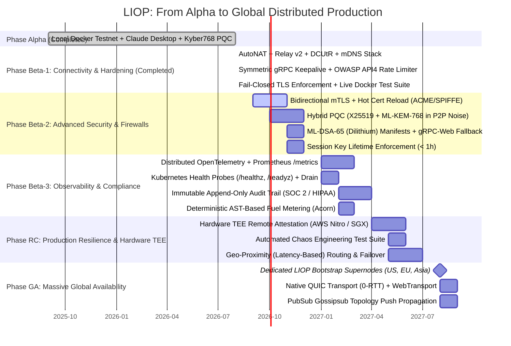

# 🌐 LIOP Global Distributed Mesh Deployment Roadmap

This document serves as the permanent, authoritative blueprint for transitioning the Logic-Injection-on-Origin Protocol (LIOP) from a local Docker testnet into an autonomous, globally distributed zero-trust mesh protocol operating across corporate networks, firewalls, and diverse geographic regions.

---

## 🗺️ Evolution Roadmap Overview

---

## ✅ 1. Completed Phases (Verified & Production-Tested)

### 1.1 Phase Alpha (Core Architecture & Zero-Trust Sandbox)
* **Status**: Complete & Verified.
* **Core Runtime**: V8 Isolate sandboxing with 25 poisoned globals, deep-frozen prototypes (11 core prototypes), and a 32KB AST Taint Analyzer (Information Flow Control) to prevent PII derivation and side channels.
* **Cryptography**: Post-Quantum ML-KEM-768 (`mlkem@2.7.0`, NIST FIPS 203) key encapsulation for gRPC intent handshakes, AES-256-GCM authenticated payload encryption, and HMAC-SHA256 ZK-Receipts binding output to logic and SOX-compliant dataset hashes.
* **Differential Privacy**: Laplace mechanism with CSPRNG (`crypto.randomBytes()`) and a 3-tier query budget (`FORBIDDEN`, `SENSITIVE`, `PUBLIC`) aligned with NIST SP 800-226.
* **Dual-Era MCP Bridge**: Seamless protocol transcoding supporting both MCP v2 (2026-07-28) and v1 legacy (2025-11-25) clients.

### 1.2 Phase Beta-1: Global Network Connectivity & Firewall Resilience
* **Status**: Complete & Verified against live 4-node Docker mesh (`nexus`, `bank`, `vault`, `oracle`).
* **P2P NAT Traversal Stack**:
  - `@libp2p/autonat`: Autonomous node reachability detection.
  - `@libp2p/circuit-relay-v2`: Client transport (`circuitRelayTransport`) and rate-limited relay reservation server (`circuitRelayServer`).
  - `@libp2p/dcutr`: Decentralized Hole Punching protocol for direct point-to-point connections through NATs.
  - `@libp2p/mdns`: Zero-configuration local area network (LAN) peer discovery.
* **Symmetric gRPC Keepalive (NIST SP 800-207)**:
  - Created `src/rpc/channel-options.ts` implementing `keepalive_time_ms: 30000`, `keepalive_timeout_ms: 10000`, and `permit_without_calls: 1`.
  - Applied symmetrically across client, server, and router to prevent silent NAT gateway timeouts.
* **Rate Limiting & DoS Defense (OWASP API4:2023)**:
  - Created `src/gateway/rate-limiter.ts` using an O(1) sliding window token bucket algorithm with periodic purge.
  - Integrated into `src/gateway/hybrid.ts` protecting `POST /mcp` with HTTP 429 (`Too Many Requests`) and `Retry-After` headers.
* **Fail-Closed TLS Hardening (`LIOP_ENFORCE_TLS`)**:
  - Configured `src/rpc/tls.ts` to abort execution when `NODE_ENV=production` or `LIOP_ENFORCE_TLS=true` if certificates are missing, eliminating silent plaintext fallback.
* **Multiaddr-Driven Docker Routing**:
  - Implemented autonomous port detection in `router.ts` (`isDockerPort`), dynamically mapping internal container endpoints to published host ports (`13011`/`13021`/`13031`) without depending on sanitized client environment variables.
* **Verification Evidence**:
  - Suite `tests/integration/docker-mesh-live.test.ts`: **8/8 live tests passing**.
  - SDK global suite: **23/23 test files passing, 216/216 tests green (100%)**.
  - BiomeJS compliance: **99 files checked, 0 errors, 0 warnings**.

---

## ⏳ 2. Upcoming Phases (Detailed Specifications)

### 🔴 Phase Beta-2: Advanced Security, P2P Post-Quantum & Firewalls
* **Target Window**: Q4 2026
* **Key Components**:
  1. **Bidirectional mTLS with Automated Certificate Rotation**:
     - Integration with ACME / cert-manager or SPIFFE/SPIRE for automated certificate issuance and hot reloading without node restarts.
     - Fast revocation via OCSP Stapling.
     - *Target Files*: `src/rpc/tls.ts`, `src/security/cert-manager.ts`.
  2. **Hybrid PQC in P2P Noise Transport (X25519 + ML-KEM-768)**:
     - Upgrade libp2p Noise XX handshake to combine classical X25519 with ML-KEM-768, neutralizing "Harvest-Now-Decrypt-Later" threats across the P2P transport.
     - *Target Files*: `src/mesh/node.ts`.
  3. **Post-Quantum Digital Signatures (ML-DSA-65 / Dilithium)**:
     - Implement NIST FIPS 204 signatures for manifest publication and node revocation.
     - *Dependencies*: `pnpm add @noble/post-quantum`.
     - *Target Files*: `src/rpc/crypto/dilithium.ts`.
  4. **Strict Session Key Lifetime Enforcement**:
     - Enforce a maximum TTL of 1 hour for PQC session secrets.
     - Reject execution in `logic-execution.ts` if the session secret timestamp exceeds 3600 seconds.
  5. **gRPC-Web Fallback & HTTP/1.1 Connect Protocol**:
     - Provide a gRPC-Web proxy (Envoy or Connect Protocol) enabling clients behind strict enterprise HTTP/1.1 WAFs and web browsers to invoke mesh nodes.
     - *Target Files*: `src/gateway/hybrid.ts`, `src/rpc/grpc-web.ts`.

---

### 🟡 Phase Beta-3: Enterprise Observability & Compliance (SOC 2 / HIPAA)
* **Target Window**: Q1 2027
* **Key Components**:
  1. **Kubernetes Health & Liveness Probes**:
     - Standardized `/healthz` and `/readyz` endpoints on the Hybrid Gateway.
     - Graceful connection draining before shutdown in `rpc/server.ts` and `mesh/node.ts`.
     - *Target Files*: `src/gateway/hybrid.ts`, `src/rpc/server.ts`.
  2. **Prometheus Metrics Endpoint (`/metrics`)**:
     - Core protocol telemetry metrics:
       - `liop_tool_calls_total{status, tool}` (Counter)
       - `liop_fuel_consumed{tool}` (Histogram)
       - `liop_mesh_peers_connected` (Gauge)
       - `liop_manifest_cache_size` (Gauge)
       - `liop_egress_blocks_total{reason}` (Counter)
       - `liop_zk_verification_duration_ms` (Histogram)
     - *Dependencies*: `pnpm add prom-client`.
     - *Target Files*: `src/observability/metrics.ts`.
  3. **Distributed OpenTelemetry Tracing**:
     - Promote `@opentelemetry/api` to production dependencies and add `@opentelemetry/sdk-node`, `@opentelemetry/exporter-otlp-http`.
     - Propagate W3C `traceparent` headers across gRPC metadata and MCP requests.
     - *Target Files*: `package.json`, `src/observability/tracing.ts`.
  4. **Immutable Audit Trail for SOC 2 Type II & HIPAA**:
     - Cryptographically signed (Ed25519) append-only JSON audit records for every `tools/call` execution.
     - Fields: `timestamp`, `agentDid`, `peerId`, `toolName`, `datasetHash`, `fuelConsumed`, `outputHash`, `zkReceiptSig`.
     - Configurable retention policy (`LIOP_AUDIT_RETENTION_DAYS`, minimum 90 days).
     - *Target Files*: `src/utils/logger.ts`, `src/security/audit-logger.ts`.
  5. **Deterministic AST-Based Fuel Metering**:
     - Replace execution-time fuel estimation (`duration * 1500`) with deterministic AST operation counting using `acorn` to ensure identical fuel consumption regardless of server CPU load.
     - *Target Files*: `src/sandbox/wasi.ts`.

---

### 🔵 Phase RC: Production Resilience & Hardware TEE Attestation
* **Target Window**: Q2 2027
* **Key Components**:
  1. **Hardware TEE Remote Attestation (AWS Nitro Enclaves / Intel SGX)**:
     - Replace the simulation stub in `crypto/verifier.ts` (`verifyTeeAttestation()`) with cryptographic verification of signed AWS Nitro attestation documents.
     - *Dependencies*: `pnpm add @aws-sdk/client-nitro-enclaves-attestation`.
     - *Target Files*: `src/crypto/verifier.ts`.
  2. **Automated Chaos Engineering Suite**:
     - Automated test suite verifying mesh behavior under simulated transcontinental WAN latency (300ms), packet loss, partition splits, and abrupt bootstrap node termination.
     - *Target Files*: `tests/chaos/network-partition.test.ts`, `tests/chaos/bootstrap-drain.test.ts`.
  3. **Geo-Proximity Routing & Multi-Region Failover**:
     - RTT-aware and region-aware routing prioritizing closest geographic nodes with seamless failover.
     - *Target Files*: `src/gateway/router.ts`.

---

### 🟣 Phase GA: Massive Global Availability & High-Performance WAN
* **Target Window**: Q3 2027
* **Key Components**:
  1. **Dedicated Global Bootstrap Supernodes**:
     - Deploy at least 3 geographically separated LIOP bootstrap clusters with Anycast DNS:
       - US-East (N. Virginia)
       - EU-West (Frankfurt)
       - AP-Southeast (Singapore)
     - Completely eliminate dependency on third-party `bootstrap.libp2p.io`.
  2. **Native QUIC Transport (0-RTT)**:
     - Incorporate `@libp2p/quic`, reducing initial connection handshakes to 0-1 RTT and maximizing throughput across transoceanic WAN links.
     - *Dependencies*: `pnpm add @libp2p/quic`.
  3. **WebTransport for Direct Browser Connectivity**:
     - Enable `@libp2p/webtransport` for direct browser connectivity without intermediary proxy gateways.
     - *Dependencies*: `pnpm add @libp2p/webtransport`.
  4. **PubSub Gossipsub for Push Topology Propagation**:
     - Implement `@chainsafe/libp2p-gossipsub` for instant push notifications of new tools, key rotations, and revoked nodes without DHT polling intervals.
     - *Dependencies*: `pnpm add @chainsafe/libp2p-gossipsub`.
  5. **Zstandard Payload Compression**:
     - Transparent zstd compression for payloads and manifests exceeding 1 KB.

---

## 📦 Dependency Matrix by Phase

| Phase | Package Installation Command | Architectural Purpose |
|---|---|---|
| **Beta-1** *(Complete)* | `pnpm add @libp2p/autonat @libp2p/circuit-relay-v2 @libp2p/dcutr @libp2p/mdns` | NAT Traversal, Circuit Relay, Hole Punching, LAN Discovery |
| **Beta-2** | `pnpm add @noble/post-quantum @grpc/grpc-js-web` | Dilithium ML-DSA signatures & gRPC-Web fallback |
| **Beta-3** | `pnpm add @opentelemetry/sdk-node @opentelemetry/exporter-otlp-http prom-client` | OpenTelemetry OTLP tracing, Prometheus exporter & metrics |
| **RC** | `pnpm add @aws-sdk/client-nitro-enclaves-attestation` | AWS Nitro Enclaves hardware attestation verification |
| **GA** | `pnpm add @libp2p/quic @libp2p/webtransport @chainsafe/libp2p-gossipsub` | 0-RTT QUIC, browser WebTransport, Gossipsub push network |
