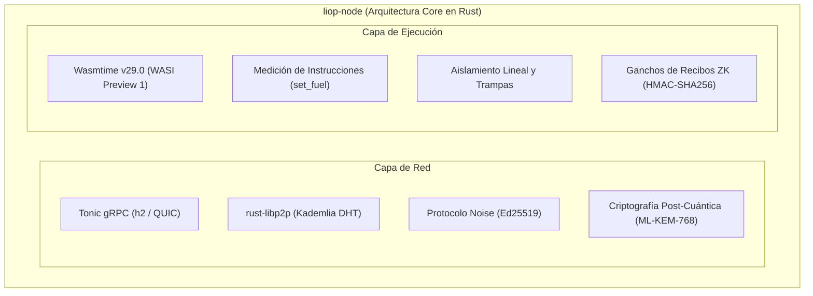

Mientras que `@nekzus/liop` ofrece la experiencia de desarrollo en Node.js y TypeScript, los fundamentos del protocolo residen en el **Backend de Rust** ubicado en `servers/liop-node/`.

Este espacio de trabajo implementa los buffers de protocolo binario optimizados, la frontera de ejecución del motor `Wasmtime` con control de cuota de instrucciones (*fuel metering*) y la pila de transporte punto a punto nativa con `rust-libp2p`.

Interactúe directamente con el núcleo de Rust en estos escenarios:
- Creación de un SDK de LIOP para un lenguaje compilado (ej. Go, C++, extensiones nativas de Python).
- Modificación del gestor de trampas de memoria de Wasmtime o de los descriptores preabiertos de WASI.
- Ajuste de los algoritmos de enrutamiento en la DHT de Kademlia o en los protocolos de negociación Noise.



---

## Arquitectura del Espacio de Trabajo Cargo

El espacio de trabajo divide las responsabilidades del protocolo en crates especializados:

<CardGroup cols={2}>
  <Card title="liop-core" icon="cube">
    Definición binaria del protocolo. Aloja las estructuras compiladas de Protobuf (`liop_core.proto`) generadas mediante `tonic` y `prost`. Define la trama inmutable que viaja por la red.
  </Card>
  <Card title="liop-node" icon="shield-halved">
    Bastión del Nodo de Datos. Emplea `wasmtime` para crear la frontera de ejecución WASI donde opera la lógica WebAssembly entrante. Incorpora interfaces para módulos de seguridad por hardware y cómputo de Recibos ZK.
  </Card>
  <Card title="liop-client" icon="network-wired">
    Nodo Agente nativo. Despacha cargas de lógica a través de la malla mediante `rust-libp2p` con enrutamiento Kademlia DHT y autenticación con el protocolo Noise.
  </Card>
  <Card title="wasm-filters" icon="microchip">
    Módulos de lógica precompilados orientados al target `wasm32-wasip1`. Contiene algoritmos de filtrado estadístico, agregación y detección de anomalías para su despliegue in-situ.
  </Card>
</CardGroup>

---

## Pila de Transporte de Red

LIOP exige canales bidireccionales de baja latencia con multiplexación para procesar la ejecución de capacidades y la telemetría en tiempo real:

1. **Tonic (gRPC sobre HTTP/2):**
   Tonic gestiona el empaquetado de mensajes, el control de flujo y la contrapresión de forma asíncrona sobre el runtime multihilo de `tokio`. Todas las cargas se serializan en Protobuf binario; de este modo suprimen la sobrecarga de codificación JSON.
2. **rust-libp2p (Noise y Kademlia):**
   Los nodos autentican su identidad criptográfica Ed25519 mediante el **Noise Protocol Framework** (patrón de negociación `XX`). Los pares descubren capacidades y contenidos a través del identificador canónico de Kademlia DHT (`/ipfs/kad/1.0.0`), lo que suprime la dependencia de servidores DNS o autoridades de certificación centralizadas.

---

## Frontera de Ejecución y Medición de Instrucciones (Fuel)

La ruta central de procesamiento se ubica en `servers/liop-node/src/executor.rs`:

```rust
use wasmtime::*;
use wasmtime_wasi::sync::WasiCtxBuilder;

pub struct WasmExecutor {
    engine: Engine,
    linker: Linker<WasiCtx>,
}

impl WasmExecutor {
    pub fn execute(&self, wasm_bytes: &[u8], fuel_limit: u64) -> Result<Vec<u8>, ExecutionError> {
        let mut config = Config::new();
        config.consume_fuel(true);
        config.wasm_memory64(false);

        let mut store = Store::new(&self.engine, wasi_ctx);
        store.set_fuel(fuel_limit)?;

        let module = Module::from_binary(&self.engine, wasm_bytes)?;
        let instance = self.linker.instantiate(&mut store, &module)?;

        let run_fn = instance.get_typed_func::<(), i32>(&mut store, "liop_entry")?;
        let exit_code = run_fn.call(&mut store, ())?;

        Ok(extracted_result)
    }
}
```

### Invariantes de Seguridad del Sandbox

- **Trampas de Cuota de Instrucciones (Fuel)**: Cada instrucción ejecutada descuenta del contador asignado. Los bucles infinitos provocan una trampa determinista `Trap::OutOfFuel` antes de saturar los núcleos de la CPU anfitriona.
- **Límites de Memoria Lineal**: Las asignaciones de memoria se restringen a páginas fijas de 64 KB en WebAssembly. Todo intento de lectura o escritura fuera de la memoria reservada activa un fallo de segmentación contenido dentro del subproceso.
- **Descriptores Preabiertos de WASI**: Los módulos aislados no pueden recorrer el sistema de archivos del anfitrión. Solo acceden a subdirectorios montados explícitamente mediante `WasiCtxBuilder::preopened_dir()`.

---

## Comparativa Empírica de Rendimiento

La tabla muestra el comportamiento del nodo nativo en Rust frente al SDK de Node.js y las pasarelas REST habituales:

| Dimensión de Rendimiento | Nodo Nativo Rust (`liop-node`) | SDK de TypeScript (`@nekzus/liop`) | Línea Base REST / JSON-RPC |
|---|---|---|---|
| **Latencia de Arranque en Frío** | `0.42 ms` (Caché JIT Wasmtime) | `3.80 ms` (Inicialización Isolate V8) | `45.0 ms` (Creación de proceso) |
| **Consumo de Memoria en Reposo** | `14.2 MB` (Tamaño de conjunto residente) | `48.5 MB` (Runtime de Node.js) | `110.0 MB` (Pasarela API Gateway) |
| **Rendimiento de Agregación In-Situ** | `84.000 ops/seg` | `28.500 ops/seg` | `2.400 ops/seg` (Extracción por red) |
| **Acuerdo Criptográfico Post-Cuánt.** | `0.18 ms` (SIMD nativo) | `1.15 ms` (Enlace WASM / C++) | No disponible (Solo TLS 1.3) |
| **Mecanismo de Aislamiento** | Fuel Wasmtime + Trampas de Memoria | Contexto Aislado V8 + Congelamiento | Namespaces y cgroups en contenedor |
