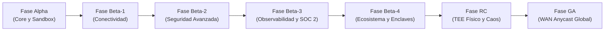

La hoja de ruta del protocolo LIOP (Logic-Injection-on-Origin Protocol) define la transición arquitectónica desde una red local de pruebas en contenedores Docker hacia una malla distribuida global y autónoma basada en confianza cero. El protocolo opera atravesando cortafuegos corporativos, enclaves soberanos y diversas regiones de nube pública y privada.

---

## Cronología de Evolución Estratégica

| Fase | Ventana Temporal | Foco Arquitectónico | Estado de Certificación |
|---|---|---|---|
| **Fase Alpha** | Q3 2025 - Q3 2026 | Sandbox V8 y Criptografía Post-Cuántica | Completada (64/64 suites de pruebas superadas) |
| **Fase Beta-1** | Q3 2026 | NAT Traversal, Relay v2, Keepalive y DoS | Completada (Malla multinodo Docker en vivo) |
| **Fase Beta-2** | Q3 2026 | Firmas ML-DSA-65, mTLS y gRPC-Web | Completada (Paridad total en Biome y pruebas) |
| **Fase Beta-3** | Q3 2026 - Q4 2026 | OpenTelemetry, Prometheus y Pista SOC 2 | Completada (Latencia de raspado subsegundo) |
| **Fase Beta-4** | Q4 2026 | Malla Soberana Tricapa y LIOP Studio | Completada (64/64 pruebas de auditoría superadas) |
| **Fase RC** | Q4 2026 - Q1 2027 | Atestación TEE en Hardware e Ingeniería de Caos | En Curso (AWS Nitro y AMD SEV-SNP) |
| **Fase GA** | Q2 2027 - Q3 2027 | Supernodos Anycast, QUIC Nativo y Gossipsub | Planificada (Despliegue multirregión global) |

---

## 1. Fases Certificadas en Producción

### Fase Alpha: Arquitectura Núcleo y Sandbox Zero-Trust
- **Aislamiento en Isolate V8**: Aplica envenenamiento sobre 27 identificadores globales, congelamiento estricto sobre 11 prototipos del lenguaje y un analizador estático de flujo de información (IFC) de 32 KB para impedir la inferencia indirecta de datos confidenciales.
- **Criptografía Post-Cuántica**: Implementa ML-KEM-768 (`mlkem`, estándar NIST FIPS 203) para intercambio cuántico de intenciones gRPC, cifrado simétrico AES-256-GCM y recibos computacionales HMAC-SHA256 vinculados al hash del conjunto de datos.
- **Privacidad Diferencial**: Incorpora adición de ruido Laplace mediante CSPRNG y gestión de presupuesto analítico en tres niveles (`FORBIDDEN`, `SENSITIVE`, `PUBLIC`) conforme a NIST SP 800-226.
- **Puente MCP Multiera**: Motor de transcodificación compatible simultáneamente con clientes modernos MCP v2 (2026-07-28) y clientes tradicionales MCP v1 (2025-11-25).

### Fase Beta-1: Conectividad Global y Resiliencia ante Cortafuegos
- **Pila P2P de Evasión NAT**: Integración completa de `@libp2p/autonat`, `@libp2p/circuit-relay-v2`, `@libp2p/dcutr` y `@libp2p/mdns` para perforación descentralizada de puertos en cortafuegos corporativos.
- **Keepalive Simétrico gRPC**: Estandarización de opciones de canal (`keepalive_time_ms: 30000`, `keepalive_timeout_ms: 10000`, `permit_without_calls: 1`) que evitan el cierre silencioso de sockets en pasarelas NAT.
- **Limitación de Tasa y Defensa DoS**: Implementación del limitador de cubo de fichas que protege `POST /mcp` con respuestas HTTP 429 y cabeceras `Retry-After` siguiendo OWASP API4:2023.
- **Endurecimiento TLS Fail-Closed**: Verificación estricta de certificados en entornos productivos que suprime degradaciones involuntarias a texto plano.

### Fase Beta-2: Seguridad Avanzada, Firmas Post-Cuánticas y Pasarelas
- **Firmas Digitales Post-Cuánticas**: Implementación de ML-DSA-65 (NIST FIPS 204) mediante `@noble/post-quantum` para el sellado de manifiestos y la validación de identidad entre nodos.
- **Vida Útil Estricta de Claves de Sesión**: Límite máximo de una hora (3.600 segundos) para todo secreto de sesión acordado mediante ML-KEM-768, con rechazo de credenciales vencidas según controles NIST SP 800-53.
- **mTLS Bidireccional con Recarga en Caliente**: Módulo `CertManager` con observadores del sistema de archivos para rotar certificados X.509 sin detener los servicios en ejecución.
- **Tramado gRPC-Web HTTP/1.1**: Soporte del estándar de 5 bytes en `LiopHybridGateway`, lo que permite invocar nodos LIOP a través de navegadores y proxies empresariales de Capa 7.

### Fase Beta-3: Observabilidad Corporativa y Cumplimiento Normativo
- **Sondas Kubernetes y Drenado Limpio**: Endpoints `/healthz` y `/readyz` con comprobación del estado de la tabla DHT y temporizadores para drenar conexiones activas.
- **Telemetría Nativa Prometheus**: Raspador síncrono que expone `liop_mesh_peers_connected`, `liop_manifest_cache_size` y métricas de consumo de cómputo en tiempo real.
- **Convenciones Semánticas OpenTelemetry**: Trazas unificadas que registran `gen_ai.client.token.usage` y latencias de ejecución en toda la malla.
- **Pista de Auditoría Inmutable**: Cadena criptográfica de resúmenes encadenados que asegura no repudio para revisiones bajo normas SOC 2 Tipo II e HIPAA.
- **Medición de Cuota AST Determinista**: Cuantización de instrucciones en bloques de 100 unidades que neutraliza canales laterales basados en tiempo de ejecución.

### Fase Beta-4: Ecosistema para Desarrolladores y Enclaves Soberanos
- **Playground Web Interactivo**: Consola de depuración con transmisión SSE de fases criptográficas, gráficas de telemetría y visualización de pruebas de integridad.
- **Enclaves Soberanos Tricapa**: Segmentación física mediante claves compartidas de enjambre de 256 bits (`pnet`), con enrutamiento de peticiones confidenciales de Nivel 1 a través de la pasarela BLG.
- **Batería Automatizada de Auditoría en Producción**: Conjunto de 12 pruebas de integración ejecutadas en contenedores bajo condiciones de red adversas con fluctuación y pérdida de paquetes.

---

## 2. Hitos Arquitectónicos en Desarrollo

### Fase RC: Resiliencia en Producción, TEE Físico y Paridad en Rust
- **Ventana Estimada**: Cuarto trimestre de 2026 a primer trimestre de 2027.
- **Paridad del Núcleo en Rust (`servers/liop-node`)**:
  - Incorporar soporte para enclaves `libp2p-pnet` en Rust con aislamiento estricto de paquetes.
  - Implementar transcodificación multiera MCP directamente en la pasarela Rust.
  - Mantener opciones de canal gRPC simétricas con Tonic en todos los enclaves.
- **Atestación Remota de Hardware TEE**:
  - Validar criptográficamente reportes físicos de hardware como AMD SEV-SNP (`snp_report_t`) y AWS Nitro Enclaves (`COSE_Sign1`), lo que sustituye las simulaciones de prueba por mediciones de silicio.
- **Ingeniería de Caos Automatizada**:
  - Ejecutar escenarios de prueba con simulación de particiones de red intercontinentales, latencias de 300 milisegundos y desconexión abrupta de nodos de arranque.
- **Enrutamiento Dinámico por Proximidad Geográfica**:
  - Dirigir la ejecución hacia los nodos con menor latencia de ida y vuelta mediante interruptores de circuito automáticos.

### Fase GA: Red WAN Global de Alto Rendimiento
- **Ventana Estimada**: Segundo a tercer trimestre de 2027.
- **Supernodos de Arranque Dedicados**:
  - Desplegar clústeres Anycast en América, Europa y Asia para eliminar la dependencia de servidores de arranque compartidos.
- **Transporte Nativo QUIC**:
  - Integrar `@libp2p/quic` para reducir el establecimiento de conexión a 0-RTT y acelerar transferencias en enlaces transoceánicos.
- **Conectividad Directa mediante WebTransport**:
  - Adoptar WebTransport para que aplicaciones web y clientes en navegador interactúen con la malla sin necesidad de pasarelas intermedias.
- **Sincronización por Gossipsub**:
  - Difundir anuncios de herramientas y revocación de certificados en tiempo real a través de la red de difusión de libp2p.

---

## 3. Matriz de Dependencias por Fase

| Fase | Comando de Instalación de Paquetes | Propósito Arquitectónico |
|---|---|---|
| **Beta-1** *(Completada)* | `pnpm add @libp2p/autonat @libp2p/circuit-relay-v2 @libp2p/dcutr @libp2p/mdns` | Evasión de NAT, Circuit Relay, Hole Punching y Descubrimiento en red local |
| **Beta-2** *(Completada)* | `pnpm add @noble/post-quantum @grpc/grpc-js-web` | Firmas Dilithium ML-DSA y fallback de transporte gRPC-Web |
| **Beta-3** *(Completada)* | `pnpm add @opentelemetry/sdk-node @opentelemetry/exporter-otlp-http prom-client` | Trazas OpenTelemetry OTLP y exportador de métricas Prometheus |
| **RC** *(En Curso)* | `pnpm add @aws-sdk/client-nitro-enclaves-attestation` | Verificación criptográfica de atestación física AWS Nitro Enclaves |
| **GA** *(Planificada)* | `pnpm add @libp2p/quic @libp2p/webtransport @chainsafe/libp2p-gossipsub` | Transporte 0-RTT QUIC, WebTransport para navegador y red Gossipsub |
