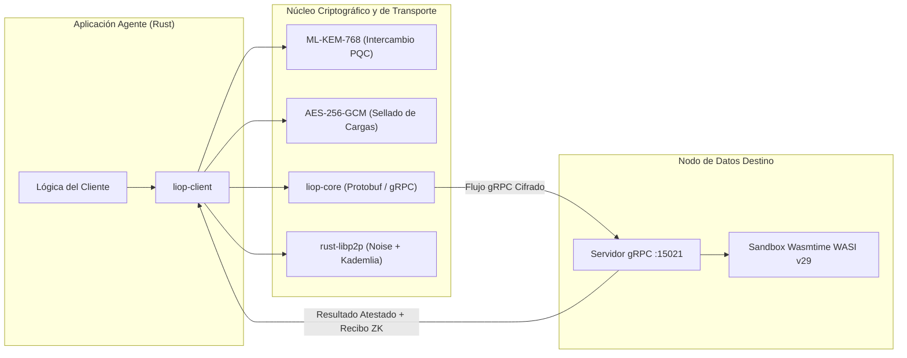

El Protocolo Logic-Injection-on-Origin (LIOP) provee crates nativos en Rust optimizados para entornos de agentes de baja latencia, software de sistemas y enclaves seguros.

<Warning>
  El SDK de Rust se encuentra actualmente en fase **Alpha (v0.1.0)** en desarrollo activo. Las interfaces y firmas de funciones pueden variar antes de su publicación formal en [crates.io](https://crates.io). Para despliegues corporativos en producción que requieran pasarelas multicapa, autenticación OAuth 2.1 automatizada e interceptores L7 certificados, consulte el [SDK de TypeScript](/es/typescript-sdk/overview).
</Warning>

---

## Arquitectura de los Crates

La implementación en Rust se organiza en dos crates especializados dentro del espacio de trabajo del repositorio:

<CardGroup cols={2}>
  <Card title="liop-core" icon="cube">
    **Protocolo Binario y Stubs**: Definiciones de Protocol Buffers (`liop_core.proto`) compiladas mediante `tonic` y `prost`. Exporta traits de servicios gRPC, stubs de cliente y tipos de mensajes de red sin dependencias pesadas de ejecución.
  </Card>
  <Card title="liop-client" icon="network-wired">
    **Motor de Ejecución del Agente**: Runtime de cliente de alto nivel que encapsula la negociación de intenciones Zero-Trust, derivación de claves post-cuánticas (ML-KEM-768), sellado simétrico de cargas (AES-256-GCM) y validación de Recibos ZK.
  </Card>
</CardGroup>



---

## Configuración de Dependencias con Cargo

Hasta la publicación oficial en `crates.io`, los crates se integran directamente desde el repositorio de GitHub o mediante rutas locales dentro de un espacio de trabajo Cargo.

### Integración desde el Repositorio Git

Añada la siguiente configuración en su archivo `Cargo.toml`:

```toml Cargo.toml
[dependencies]
liop-core = { git = "https://github.com/Nekzus/LIOP", branch = "main" }
liop-client = { git = "https://github.com/Nekzus/LIOP", branch = "main" }

# Runtime asíncrono Tokio
tokio = { version = "1.37", features = ["rt-multi-thread", "macros"] }
```

### Integración mediante Ruta Local de Workspace

Para desarrollos dentro de un clon local del repositorio de LIOP:

```toml Cargo.toml
[dependencies]
liop-core = { path = "sdks/rust/crates/core" }
liop-client = { path = "sdks/rust/crates/client" }
tokio = { version = "1.37", features = ["rt-multi-thread", "macros"] }
```

---

## Ejemplo de Inyección de Lógica WASI In-Situ

El crate `liop-client` expone la función `inject_logic`, la cual automatiza las cinco etapas del ciclo criptográfico:

1. **Negociación de Intención Zero-Trust**: Establece los parámetros de sesión con el nodo de destino.
2. **Intercambio de Claves Post-Cuánticas**: Genera un par de claves efímeras ML-KEM-768 y encapsula un secreto compartido de 256 bits.
3. **Sellado de Carga Útil**: Cifra el binario WASM compilado (`wasm32-wasip1`) mediante AES-256-GCM.
4. **Transmisión Asíncrona por Flujos**: Despacha el módulo cifrado a través de Tonic gRPC hacia el entorno host.
5. **Verificación de Recibo ZK**: Valida la prueba computacional HMAC-SHA256 emitida por el nodo de datos frente al secreto de sesión y el hash de la carga.

```rust src/main.rs
use liop_client::injector::inject_logic;
use std::error::Error;

#[tokio::main]
async fn main() -> Result<(), Box<dyn Error>> {
    // Dirección del nodo seguro de destino (ej. Vault Enclave o Nodo Edge)
    let endpoint = "http://127.0.0.1:15021";
    let wasm_path = "./target/wasm32-wasip1/release/order_filter.wasm";

    println!("[Agente] Inyección de lógica analítica iniciada en {}", endpoint);

    // Ejecución automatizada de negociación, encapsulación, transporte y verificación
    let response = inject_logic(endpoint, wasm_path).await?;

    println!("[Agente] Estado de respuesta: {}", response.status);
    println!("[Agente] Resultado agregado: {}", response.data);
    println!("[Agente] Recibo ZK verificado: {}", response.zk_receipt);

    Ok(())
}
```

---

## Especificaciones Técnicas y Dependencias

Los crates conservan un árbol de dependencias acotado para asegurar compilaciones deterministas y estabilidad de memoria:

| Componente | Tecnología | Versión | Responsabilidad Arquitectónica |
|---|---|---|---|
| **Transporte gRPC** | `tonic` | 0.12 | Manejo asíncrono sobre HTTP/2, control de flujo y streaming bidireccional |
| **Serialización** | `prost` | 0.13 | Codificación y decodificación binaria eficiente de Protocol Buffers |
| **Criptografía Post-Cuántica** | `pqcrypto-kyber` | 0.8 | Mecanismo de encapsulación de claves ML-KEM-768 resistente a algoritmos cuánticos |
| **Cifrado Simétrico** | `aes-gcm` | 0.10 | Cifrado autenticado con datos asociados (AEAD) para módulos WASM |
| **Red P2P** | `rust-libp2p` | 0.54 | Descubrimiento descentralizado de nodos mediante Kademlia DHT y seguridad con Noise |
| **Runtime Asíncrono** | `tokio` | 1.37 | Motor de ejecución multihilo sin bloqueos |

---

## Hoja de Ruta hacia `crates.io`

El plan de evolución para el SDK de Rust contempla tres hitos centrales:

1. **Soporte para WASI Preview 2 (Component Model)**: Migración desde `wasm32-wasip1` hacia interfaces WIT para habilitar el intercambio de tipos estructurados entre el huésped y el host.
2. **Traits Ergonómicos de Servidor**: Creación del trait de alto nivel `LiopServer` equivalente a la experiencia del SDK de TypeScript, lo que simplificará la construcción de enclaves nativos en Rust.
3. **Automatización de Publicación en Crates.io**: Implementación de flujos de CI/CD para publicaciones automatizadas con verificación de procedencia OIDC.
