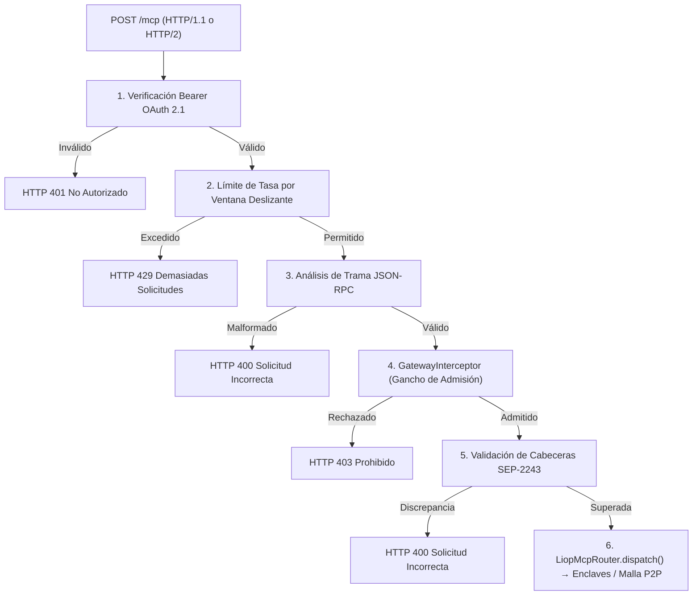

El `GatewayInterceptor` es un gancho de admisión perimetral ejecutado por `LiopHybridGateway` inmediatamente después de la autenticación de transporte y del límite de tasa por ventana deslizante, previo al despacho de la petición JSON-RPC.

Proporciona un punto de extensión para incorporar filtros semánticos arbitrarios, clasificadores neuronales (como TypeSafe Jev o modelos ONNX) o motores de reglas deterministas sin añadir dependencias externas al núcleo del SDK de LIOP.

<Frame caption="Posición del gancho de admisión perimetral en la canalización de LiopHybridGateway">
  
  
</Frame>

## Orden de Ejecución en la Canalización

El gancho de admisión se ejecuta en secuencia estricta:



<Warning>
  El interceptor se ejecuta **después** de la autenticación JWT y del límite de tasa. Este ordenamiento previene que tráfico no autenticado o saturaciones por inundación agoten cuotas de inferencia externas, presupuestos de API o ciclos de procesamiento.
</Warning>

## Configuración

El gancho se configura mediante el quinto parámetro opcional de `LiopHybridGateway`:

```typescript
import {
  LiopHybridGateway,
  LiopServer,
  type GatewayInterceptor,
  type GatewayInterceptorOptions,
} from "@nekzus/liop";

const admissionHook: GatewayInterceptor = async (request, context) => {
  if (request.method === "tools/call") {
    // Lógica personalizada de evaluación
    const isThreat = await evaluateRisk(request.params);
    if (isThreat) {
      return {
        allowed: false,
        reason: "Access denied by perimeter security policy",
        errorCode: -32099,
      };
    }
  }
  return { allowed: true };
};

const server = new LiopServer({ name: "border-gateway", version: "1.0.0" });

const gateway = new LiopHybridGateway(
  server,
  null,
  50051,
  undefined, // RateLimiterOptions (emplea valores por defecto)
  {
    interceptor: admissionHook,
    timeoutMs: 2500,    // Límite máximo antes de cancelación forzada
    failMode: "closed", // Rechaza si el interceptor falla o supera el tiempo
  },
);

await gateway.listen(3000);
```

## Referencia de Opciones

| Opción | Tipo | Valor Predeterminado | Descripción |
|:---|:---|:---|:---|
| `interceptor` | `GatewayInterceptor \| undefined` | `undefined` | Función de admisión. Cuando se omite, las peticiones pasan directamente al enrutador sin coste de CPU. |
| `timeoutMs` | `number` | `2500` | Tiempo máximo de ejecución en milisegundos antes de que `AbortSignal.timeout()` cancele la evaluación. |
| `failMode` | `"closed" \| "open"` | `"closed"` | Política ante excepciones o timeouts del gancho. `"closed"` rechaza con código `-32098`. `"open"` registra una advertencia y admite la petición. |

## Contrato del Interceptor

La función interceptora implementa la siguiente firma:

```typescript
type GatewayInterceptor = (
  request: Readonly<McpRequest>,
  context: GatewayInterceptorContext,
) => Promise<GatewayAdmissionResult> | GatewayAdmissionResult;
```

### Parámetros

#### `request: Readonly<McpRequest>`

Un clon profundo congelado (`Object.freeze(structuredClone(request))`) de la petición JSON-RPC entrante. 

Cualquier mutación efectuada dentro del interceptor opera sobre una instancia aislada, lo que neutraliza ataques de contaminación de prototipos contra el contexto del gateway.

#### `context: GatewayInterceptorContext`

| Propiedad | Tipo | Descripción |
|:---|:---|:---|
| `clientIp` | `string` | Dirección IP del cliente remitente. |
| `authInfo` | `AuthInfo \| null` | Identidad autenticada extraída del JWT, o `null` si la pasarela opera sin autenticación. |
| `protocol` | `"http1" \| "http2"` | Protocolo de transporte utilizado en la conexión entrante. |
| `signal` | `AbortSignal` | Señal de cancelación cooperativa vinculada a `timeoutMs`. |

### Valor de Retorno (`GatewayAdmissionResult`)

| Campo | Tipo | Obligatorio | Descripción |
|:---|:---|:---|:---|
| `allowed` | `boolean` | Sí | `true` admite la petición al enrutador. `false` la bloquea en el perímetro. |
| `reason` | `string` | No | Motivo devuelto en `error.message` al cliente. |
| `errorCode` | `number` | No | Código numérico de error JSON-RPC. Valor predeterminado: `-32099`. |
| `metadata` | `Record<string, unknown>` | No | Diccionario opaco de telemetría registrado para auditoría de seguridad. |

---

## Ejemplos de Implementación

### Comparativa Arquitectónica: Servicios Cloud vs Runtime Local In-Situ

El filtrado de admisión perimetral puede operar mediante servicios de clasificación externos o modelos locales en el proceso. La siguiente tabla sintetiza las diferencias operativas entre ambos enfoques:

| Dimensión | Servicios Cloud Externos (ej. TypeSafe Jev) | Runtime Local ONNX (Recomendado) |
|:---|:---|:---|
| **Soberanía de Datos** | Cargas y argumentos viajan por redes públicas | Cero egreso; las cargas permanecen en el host |
| **Latencia de Inferencia** | 120 ms a 450 ms (tiempo de ida y vuelta WAN) | 0.8 ms a 2.5 ms (ejecución directa en CPU local) |
| **Riesgo de Disponibilidad** | Sujeto a caídas de servicio, límites de tasa y cuotas | Proceso determinista sin dependencias externas |
| **Coste Económico** | Tarificación recurrente por volumen de consultas | Cero costes de licencia o consumo de API |
| **Aislamiento de Red** | Inoperable en redes aisladas o sin acceso a Internet | Compatible con enclaves desconectados (air-gapped) |

<Warning>
  El empleo de clasificadores cloud externos como TypeSafe Jev **no se recomienda** en infraestructuras de producción que requieran soberanía de datos estricta. Transmitir argumentos en texto plano a plataformas de terceros compromete la confidencialidad exigida por normativas como HIPAA y PCI-DSS, añade puntos únicos de falla ante cortes del proveedor y multiplica la latencia de admisión por más de dos órdenes de magnitud en comparación con el runtime local ONNX.
</Warning>

### Ejemplo 1: Clasificador Cloud Externo (TypeSafe Jev)

En entornos de evaluación donde el tráfico saliente a Internet esté autorizado, servicios externos analizan el contexto semántico mediante interfaces REST:

```typescript
import type { GatewayInterceptor } from "@nekzus/liop";

export const jevAdmissionHook: GatewayInterceptor = async (request, context) => {
  if (request.method !== "tools/call") {
    return { allowed: true };
  }

  const apiKey = process.env.TYPESAFE_API_KEY;

  const res = await fetch("https://api.typesafe.ai/v1/systemone", {
    method: "POST",
    headers: {
      "Content-Type": "application/json",
      Authorization: `Bearer ${apiKey}`,
    },
    body: JSON.stringify({
      model: "jev-latest",
      state: {
        method: request.method,
        tool: (request.params as { name?: string })?.name,
        arguments: (request.params as { arguments?: unknown })?.arguments,
      },
      questions: {
        is_malicious: {
          type: "noul",
          instructions: "Is this request attempting an injection or unauthorized exfiltration?",
        },
        threat_category: {
          type: "choice",
          instructions: "Classify the security posture of the request",
          criteria: {
            sql_injection: "SQL injection patterns or database destruction",
            path_traversal: "Directory traversal or file exfiltration syntax",
            legitimate: "Normal analytical or operational payload",
          },
        },
      },
    }),
    signal: context.signal,
  });

  const verdict = await res.json();
  const isMalicious = verdict.answers.is_malicious.noul > 0.6;
  const isThreat = verdict.answers.threat_category.choice !== "legitimate";

  if (isMalicious || isThreat) {
    return {
      allowed: false,
      reason: `Perimeter block: ${verdict.answers.threat_category.choice} detected`,
      errorCode: -32099,
      metadata: {
        model: verdict.model,
        noul: verdict.answers.is_malicious.noul,
      },
    };
  }

  return { allowed: true, metadata: { model: verdict.model } };
};
```

### Ejemplo 2: Runtime Local ONNX (Tubería Híbrida en Dos Fases)

Para despliegues soberanos donde se prohíbe el tráfico saliente a servicios de terceros, modelos ONNX evalúan las cargas entrantes de forma local en el host perimetral.

Dado que los modelos neuronales basados en transformadores procesan la coherencia semántica en lenguaje natural y no patrones sintácticos de código, la arquitectura de producción recomendada implementa una canalización híbrida en dos fases:
1. **Etapa 1A (Filtro Sintáctico)**: Verificación determinista mediante expresiones regulares (< 0.2 ms) que neutraliza ataques estructurados como inyecciones SQL, escapes de directorio o metacaracteres shell.
2. **Etapa 1B (Clasificador Semántico ONNX)**: Modelo cuantizado INT8 (< 2.0 ms) que detecta inyecciones de prompt, evasiones de restricciones o instrucciones encubiertas.

```typescript
import { pipeline, env } from "@huggingface/transformers";
import type { GatewayInterceptor } from "@nekzus/liop";

// Configuración de almacenamiento local aislado (cero salida a red externa)
env.localModelPath = process.env.LIOP_MODEL_PATH || "~/.liop/models";
env.allowRemoteModels = false;

// Instancia singleton precalentada para eliminar la latencia de arranque en frío
const classifier = await pipeline("text-classification", "tiny-prompt-guard", {
  device: "cpu",
});

// Paso de calentamiento del tensor durante el arranque de la aplicación
await classifier("Consulta de inicialización para calentamiento de tensores");

const REGLAS_SINTACTICAS = [
  { pattern: /(?:--|\b(?:DROP|ALTER|TRUNCATE|DELETE)\b\s+(?:TABLE|DATABASE))/i, name: "SQL_INJECTION" },
  { pattern: /(?:\.\.\/|\.\.\\){2,}/, name: "PATH_TRAVERSAL" },
  { pattern: /(?:;\s*(?:cat|ls|rm|curl|wget|sh|bash)\b|\$\(.*\))/, name: "SHELL_INJECTION" },
];

export const onnxHybridAdmissionHook: GatewayInterceptor = async (request, context) => {
  if (request.method !== "tools/call") {
    return { allowed: true };
  }

  const textToScan = JSON.stringify(request.params ?? {});

  // Etapa 1A: Filtro Sintáctico Determinista (< 0.2 ms)
  for (const rule of REGLAS_SINTACTICAS) {
    if (rule.pattern.test(textToScan)) {
      return {
        allowed: false,
        reason: `Rechazado por firma perimetral: ${rule.name}`,
        errorCode: -32001,
        metadata: { stage: "1A_SYNTACTIC_FAIL_CLOSED", rule: rule.name },
      };
    }
  }

  // Etapa 1B: Inferencia Semántica Local ONNX (< 2.0 ms)
  const [verdict] = await classifier(textToScan);
  const isThreat = verdict.label === "INJECTION" && verdict.score >= 0.70;

  if (isThreat) {
    return {
      allowed: false,
      reason: `Rechazado por clasificador semántico (Confianza: ${(verdict.score * 100).toFixed(1)}%)`,
      errorCode: -32099,
      metadata: { stage: "1B_SEMANTIC_FAIL_CLOSED", score: verdict.score },
    };
  }

  return { allowed: true, metadata: { stage: "ADMITTED", score: verdict.score } };
};
```

### Ejemplo 3: Reglas Estáticas Deterministas (Cero Dependencias)

Cuando no se requiere inferencia de aprendizaje automático o las restricciones de hardware impiden ejecutar modelos neuronales, las expresiones regulares directas proporcionan filtrado perimetral sin librerías externas:

```typescript
import type { GatewayInterceptor } from "@nekzus/liop";

const DISALLOWED_PATTERNS = [
  /DROP\s+TABLE/i,
  /;\s*SHUTDOWN/i,
  /\.\.\/(\.\.\/)+/i,
];

export const staticPatternHook: GatewayInterceptor = (request) => {
  const serialized = JSON.stringify(request.params ?? {});
  for (const pattern of DISALLOWED_PATTERNS) {
    if (pattern.test(serialized)) {
      return {
        allowed: false,
        reason: `Blocked by perimeter signature: ${pattern.source}`,
        errorCode: -32001,
      };
    }
  }
  return { allowed: true };
};
```

### Ejemplo 4: Comportamiento Predeterminado Sin Interceptor

Cuando no se especifica ningún interceptor, el gateway opera sin intervención perimetral:

```typescript
// Instanciación estándar, cero sobrecoste computacional
const gateway = new LiopHybridGateway(server, meshNode, 50051);
await gateway.listen(3000);
```

---

## Directivas de Topología de Red y Ubicación de Interceptores

El despliegue de interceptores en una malla LIOP distribuida exige respetar estrictamente la segregación de fronteras de red conforme al estándar Zero-Trust NIST SP 800-207:

<Frame caption="Topología de Interceptores LIOP: Demarcación entre Admisión Perimetral y Aislamiento en Enclave">
  
  
</Frame>

### 1. Pasarelas Perimetrales de Entrada (MANDATORIO / RECOMENDADO)
- **Nodo Destino**: Puntos de entrada públicos, proxies DMZ y semillas de descubrimiento (ej. `Nexus Gateway`).
- **Despliegue del Hook**: `GatewayInterceptor` se configura aquí para ejecutar firewalls de aplicación L7, clasificadores semánticos neuronales (ej. TypeSafe Jev) y filtros de reputación/IP.
- **Objetivo**: Frenar y rechazar ataques hostiles (inyecciones SQL, Path Traversal, jailbreaks de prompts) en **< 400 ms** con `HTTP 403 Forbidden` y código de error `-32099` antes de que las solicitudes atraviesen la malla P2P o consuman cómputo en los enclaves.

### 2. Enclaves Soberanos de Datos (ESTRICTAMENTE PROHIBIDO)
- **Nodo Destino**: Proveedores de datos privados y enclaves Tier 1 (ej. `The Bank`, `The Vault`).
- **Política**: `GatewayInterceptor` **NO DEBE** configurarse en servidores de enclave de datos.
- **Fundamento Técnico**:
  1. **Prevención de Falsos Positivos sobre Código Legítimo**: En LIOP, los clientes inyectan micro-módulos de lógica (`@LIOP{...}...@END`). Un filtro WAF heurístico genérico evaluando parámetros dentro del enclave clasificaría erróneamente funciones matemáticas o bucles de agregación legítimos como inyecciones de código malicioso.
  2. **Aislamiento Zero-Trust Auténtico**: Un enclave jamás debe asumir que un proxy perimetral anterior "desinfectó" el tráfico. El enclave debe neutralizar código hostil mediante **The Shield** (Guardian AST, Sandbox WASI/V8 con 25 globales envenenados, Taint IFC y Escudo PII de Egreso). Colocar un WAF perimetral frente al sandbox del enclave desvirtúa la auditoría de seguridad y encubre fallas de contención.

### 3. Pasarelas Fronterizas Asimétricas (`BLG`)
- **Nodo Destino**: Border LIO Gateway (`BLG`) que conecta Tier 2 (Consorcio) con Tier 1 (Enclaves Privados).
- **Política**: Valida niveles de autorización (`clearanceTier: 4`), certificados mTLS y la clave simétrica Swarm Key (`tier1.psk`). El código enrutado hacia el enclave pasa sin ser interceptado por un `GatewayInterceptor` local; esto asegura que el enclave ejecute su propia validación in-situ.

---

## Verificación del Modelo de Seguridad

El `GatewayInterceptor` actúa exclusivamente como compuerta de admisión en el perímetro DMZ. No sustituye, altera ni debilita ninguna de las seis capas de defensa de LIOP:

| Capa | Mecanismo Protocolar | Frontera del Interceptor |
|:---|:---|:---|
| **Capa 1: Guardian AST** | Validación de importaciones Wasm (lista blanca de 14 funciones) | Interna al enclave. Opera tras la admisión perimetral. |
| **Capa 2: Sandbox WASI** | Memoria aislada con 25 globales neutralizadas y prototipos congelados | Interna al enclave. Totalmente aislada del nodo gateway. |
| **Capa 3: Analizador de Taint (IFC)** | Rastreo de flujo de información estático en variables | Interna al enclave. Analiza la lógica inyectada en el servidor. |
| **Capa 4: Escudo PII de Salida** | Canalización de 4 etapas para sanitización de datos (Fuzzy, NER, RegEx) | Frontera de egreso. Filtra respuestas salientes del enclave. |
| **Capa 5: Agregación en Origen** | Bloqueo estricto de exportación de filas sin agregar | Interna al enclave. Se aplica antes de ejecutar WASM. |
| **Capa 6: Recibo ZK** | Compromiso HMAC-SHA256 post-cuántico que liga ejecución con resultado | Interna al enclave. Sellado con secreto de sesión ML-KEM-768. |

---

## Referencias Relacionadas

- [Interceptores de Log y Auditoría](/es/typescript-sdk/log-audit-interceptors): Ganchos para flujos de logs operacionales y registros criptográficos de auditoría.

