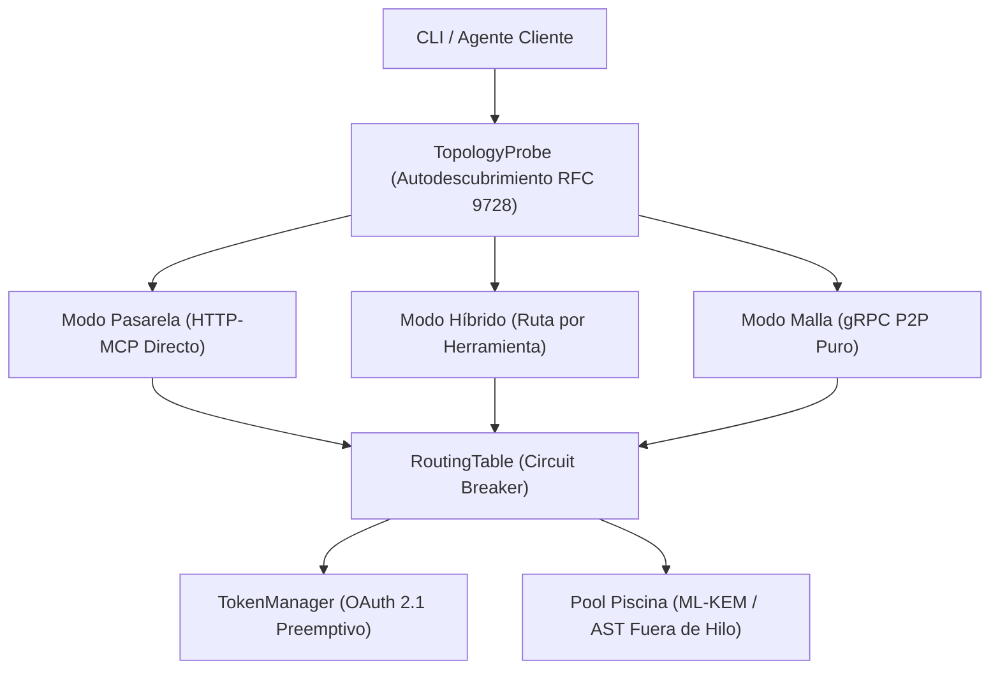

La capa de runtime de `@nekzus/liop` coordina la detección de la topología de red, el enrutamiento dinámico a través de transportes heterogéneos, los pools de cómputo fuera del hilo principal y el ciclo de vida de autenticación de máquina a máquina (M2M).

Garantiza que, independientemente de si un agente opera en un entorno de desarrollo local, en un proxy perimetral inverso o en una malla distribuida de alta seguridad, las peticiones transiten por el canal más rápido y seguro disponible.



---

## Descubrimiento Adaptativo de Red (`TopologyProbe`)

En lugar de requerir que los operadores configuren manualmente direcciones de red, multiaddrs y URLs de proveedores OIDC, `TopologyProbe` implementa autodescubrimiento mediante una única URL conforme a **RFC 9728 (Metadatos de Recursos Protegidos OAuth 2.0)**, **RFC 8414** y las directrices de arquitectura Zero Trust de **NIST SP 800-207**.

```typescript
import { probeTopology, type TopologyProbeOptions } from "@nekzus/liop";

const options: TopologyProbeOptions = {
  blgUrl: "http://127.0.0.1:15018",      // Endpoint perimetral de Border LIO Gateway
  nexusUrl: "http://127.0.0.1:15000",    // Servidor de autorización Nexus OIDC
  clientId: "mesh-diagnostic-agent",
  clientSecret: process.env.LIOP_CLIENT_SECRET,
  bootstrapNodes: [                      // Multiaddrs DHT P2P para enrutamiento soberano
    "/ip4/127.0.0.1/tcp/15001/p2p/12D3KooWDpJ7As7BWAwRMfu1VU2WCqNjvq387JEYKDBj4kx6nXTN"
  ],
  timeoutMs: 5_000,
};

const topology = await probeTopology(options);
console.log(`Modo Resuelto: ${topology.mode}`); // "gateway" | "mesh" | "hybrid"
console.log(`Herramientas Anunciadas:`, topology.advertisedTools);
```

### Opciones de Inspección de Topología

<ParamField path="options" type="TopologyProbeOptions" required>
  Descriptores de endpoints y credenciales para el análisis de red.

  <Expandable title="Propiedades de TopologyProbeOptions">
    <ResponseField name="blgUrl" type="string" optional>
      URL base HTTP de Border LIO Gateway. Se sondea mediante `/.well-known/oauth-protected-resource` y `/health`.
    </ResponseField>
    <ResponseField name="nexusUrl" type="string" optional>
      URL base HTTP del servidor de autorización central Nexus OIDC.
    </ResponseField>
    <ResponseField name="clientId" type="string" optional>
      Identificador de cliente OAuth 2.1 para acceso M2M a los recursos.
    </ResponseField>
    <ResponseField name="clientSecret" type="string" optional>
      Secreto de cliente correspondiente al `clientId`.
    </ResponseField>
    <ResponseField name="bootstrapNodes" type="string[]" optional>
      Lista de multiaddrs de `libp2p` que designan nodos bootstrap activos en Kademlia DHT.
    </ResponseField>
    <ResponseField name="timeoutMs" type="number" optional>
      Tiempo máximo de espera en milisegundos para los sondeos de descubrimiento (por defecto: `5000`).
    </ResponseField>
  </Expandable>
</ParamField>

### Matriz de Resolución de Modalidad

| Modo Resuelto | Condición de Red | Comportamiento |
|---|---|---|
| `gateway` | Border LIO Gateway accesible, sin nodos bootstrap P2P configurados. | Emplea transporte HTTP/JSON-RPC ligero sin instanciar hilos secundarios de libp2p. |
| `mesh` | Pasarela no accesible, nodos bootstrap P2P operativos. | Inicializa el nodo libp2p completo, establece canales gRPC y cifra con Noise + Kyber768. |
| `hybrid` | Tanto la pasarela como los nodos bootstrap P2P responden con éxito. | Dirige las herramientas perimetrales a través de la pasarela y procesa las consultas confidenciales en los enclaves. |

---

## Enrutamiento Híbrido por Herramienta (`RoutingTable`)

En infraestructuras empresariales, distintas capacidades presentan requisitos dispares de latencia y cumplimiento normativo. `RoutingTable` administra la asignación de transporte para cada herramienta, registra la telemetría de latencia y aplica aislamiento automático mediante disyuntores (*circuit breakers*).

```typescript
import { RoutingTable, type ToolDefinition } from "@nekzus/liop";

const table = new RoutingTable();

// 1. Registrar herramientas expuestas por una pasarela HTTP
table.registerGatewayTools(
  [{ name: "Search_Public_Docs", description: "Consulta el índice de documentación" }],
  "http://127.0.0.1:15018/mcp",
  true, // Requiere autenticación con token Bearer
);

// 2. Registrar herramientas descubiertas en la malla P2P
table.registerMeshTools(
  [{ name: "Analyze_Bank_Ledger", description: "Consolidación financiera in-situ" }],
  "127.0.0.1:15021", // Destino gRPC directo
  false, // Autenticación interna de malla
);

// 3. Registrar herramientas locales ejecutadas en el mismo proceso
table.registerLocalTool({
  name: "LiopMeshStatus",
  description: "Telemetría instantánea del nodo",
});

// 4. Resolver la ruta para una invocación entrante
const route = table.resolve("Analyze_Bank_Ledger");
console.log(`Proveedor de transporte: ${route?.provider}`); // "p2p-grpc"
```

### Invariantes del Disyuntor (Circuit Breaker)

Para evitar caídas en cascada a través de la malla, `RoutingTable` monitoriza la salud operativa de cada ruta registrada:

- **`recordSuccess(toolName, latencyMs)`**: Restablece el contador de fallos consecutivos a `0` y actualiza las medias móviles de latencia.
- **`recordFailure(toolName)`**: Incrementa el contador de fallos consecutivos.
- **Condición de Disparo (`MAX_FAILURES = 5`)**: Cuando una ruta acumula 5 fallos consecutivos, el disyuntor se abre. El runtime emite una advertencia y notifica al despachador para probar rutas de respaldo o retornar un error `ErrorCode.CIRCUIT_BREAKER_OPEN`.
- **`getAllToolDefinitions()`**: Retorna la lista de herramientas activas ordenadas alfabéticamente según exige la especificación `tools/list` del protocolo MCP.

---

## Concurrencia Fuera del Hilo Principal (Pool de Workers con `Piscina`)

Las operaciones criptográficas (intercambio de claves ML-KEM-768, descifrado AES-256-GCM) y el análisis de sintaxis AST mediante Acorn exigen un uso intensivo de CPU. Su ejecución directa en el hilo principal de Node.js provocaría retrasos en el Event Loop y pérdida de paquetes de red en tiempo real.

LIOP incorpora un pool de workers optimizado con [Piscina](https://github.com/piscinajs/piscina) que aísla este cómputo intensivo fuera del ciclo de eventos:

```typescript
import { LiopServer } from "@nekzus/liop";

const server = new LiopServer(
  { name: "HighThroughputNode", version: "1.0.0" },
  {
    workerPool: {
      enabled: true,          // Inicializa subprocesos worker dedicados
      maxThreads: 8,          // Total de hilos dedicados
      maxHeapMb: 128,         // Límite de memoria por hilo (defensa contra Heap Bombs)
      idleTimeout: 30_000,    // Intervalo de liberación de memoria por inactividad (ms)
    },
  },
);
```

### Propiedades del Pool de Workers

| Propiedad | Tipo | Valor por Defecto | Justificación Técnica |
|---|---|---|---|
| `enabled` | `boolean` | `true` | Si es `false`, procesa de forma síncrona en el hilo principal (recomendado solo para pruebas unitarias). |
| `maxThreads` | `number` | `os.cpus().length` | Crea subprocesos dedicados para aprovechar todos los núcleos físicos sin contención de hilos. |
| `maxHeapMb` | `number` | `64` | Límite estricto de memoria heap en V8 por worker. Termina subprocesos con asignación desmedida para frenar ataques DoS. Ajustable vía `LIOP_WORKER_MAX_HEAP_MB`. |
| `idleTimeout` | `number` | `30000` | Libera hilos inactivos tras 30 segundos sin carga para recuperar memoria RAM del anfitrión. |

---

## Ciclo de Vida de Tokens M2M (`TokenManager`)

La clase `TokenManager` administra el ciclo de vida de los tokens Bearer para comunicación entre máquinas conforme a los estándares **OAuth 2.1 (RFC 6749, Indicadores de Recursos RFC 8707 y Perfil JWT RFC 9068)**.

```typescript
import { TokenManager } from "@nekzus/liop";

const tokenManager = new TokenManager({
  tokenEndpoint: "http://127.0.0.1:15000/oidc/token",
  clientId: "border-gateway-client",
  clientSecret: process.env.LIOP_CLIENT_SECRET!,
  audience: "urn:liop:mesh:api",
  scopes: "liop:tools:call liop:mesh:query",
});

// Obtiene el token activo de la memoria caché o ejecuta la solicitud Client Credentials
const token = await tokenManager.getToken();
```

### Renovación Preemptiva y Deduplicación Concurrente

Para tolerar ráfagas de peticiones sin experimentar errores transitorios de autorización (HTTP 401), `TokenManager` implementa dos mecanismos principales:

1. **Margen de Renovación Preemptiva (`REFRESH_BUFFER_MS = 30_000`)**: Si a un token de acceso le quedan menos de 30 segundos de vigencia, `TokenManager` solicita uno nuevo *antes* de despachar la petición de red. Esto evita condiciones de carrera durante ejecuciones extensas de módulos WASI.
2. **Coalescencia de Solicitudes en Vuelo**: Cuando múltiples llamadas concurrentes solicitan `getToken()` con la caché vacía o expirada, `TokenManager` agrupa todas las peticiones en una única promesa HTTP POST (`pendingPromise`). Todos los invocadores resuelven con la misma respuesta de red para prevenir la saturación de cuota del servidor OIDC.

### Invalidación Reactiva

Cuando los enclaves superiores renuevan certificados o invalidan credenciales activas, las pasarelas purgan los tokens desactualizados de forma inmediata:

```typescript
try {
  await dispatchRpc(route, payload, await tokenManager.getToken());
} catch (error) {
  if (isHttp401(error)) {
    tokenManager.invalidate(); // Elimina el token desactualizado de la caché en memoria
    return await dispatchRpc(route, payload, await tokenManager.getToken());
  }
  throw error;
}
```
