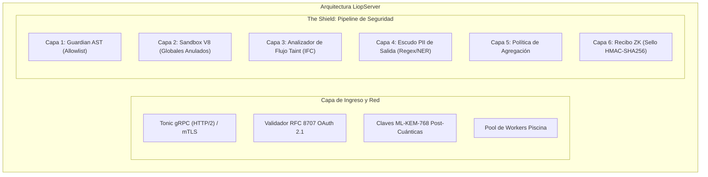

La clase `LiopServer` constituye la infraestructura receptora del protocolo Logic-Injection-on-Origin. Aloja conjuntos de datos confidenciales, aplica fronteras criptográficas, valida módulos de lógica entrantes en WebAssembly o JavaScript mediante Guardian AST y los ejecuta dentro de sandboxes aislados de V8 bajo estrictos límites de memoria e instrucciones de CPU.

En lugar de exponer endpoints de alto riesgo basados en REST o consultas SQL directas a agentes remotos de inteligencia artificial, un `LiopServer` declara **Capacidades** (Herramientas) estrictamente tipadas. Los agentes envían programas compilados para computar los resultados in-situ; de este modo impiden que los registros crudos viajen por la red.



---

## Creación y Configuración del Servidor

Inicialice un Nodo de Datos definiendo su identidad pública y sus parámetros de seguridad perimetral:

```typescript
import { LiopServer, PII_PRESETS } from "@nekzus/liop";

const server = new LiopServer(
  {
    name: "ConfidentialBankEnclave",
    version: "2.4.0",
  },
  {
    tokenSlug: "BANK",
    port: 15021,
    workerPool: {
      enabled: true,
      maxThreads: 8,
      maxHeapMb: 128,
      idleTimeout: 30_000,
    },
    security: {
      forbiddenKeys: ["password", "secret", "privateKey", "cvv", "raw_balance"],
      piiPatterns: [
        ...PII_PRESETS.US_COMPLIANT,
        /[A-Z]{2}\d{6}[A-Z]/, // Patrón interno de credenciales bancarias
      ],
      enableNerScanning: true,
      rateLimit: {
        maxPerWindow: 60,
        windowMs: 60_000,
      },
    },
    taxonomy: {
      domain: "financial-ledger",
      clearanceTier: 4,
      executionTypes: ["aggregation", "statistical-audit"],
    },
  },
);
```

### Opciones de Configuración del Servidor

<ParamField path="serverInfo" type="object" required>
  Identidad canónica transmitida durante la negociación del protocolo.
  
  <Expandable title="Propiedades de serverInfo">
    <ResponseField name="name" type="string" required>
      Identificador del nodo de datos (ej. `"EnterpriseVault"`).
    </ResponseField>
    <ResponseField name="version" type="string" required>
      Versión SemVer del despliegue en producción.
    </ResponseField>
  </Expandable>
</ParamField>

<ParamField path="options" type="ServerOptions" optional>
  Configuración integral de seguridad, concurrencia en hilos y taxonomía de red.

  <Expandable title="Propiedades de ServerOptions">
    <ResponseField name="port" type="number" optional>
      Puerto TCP donde escucha el servicio gRPC (por defecto: `50051`).
    </ResponseField>
    <ResponseField name="tokenSlug" type="string" optional>
      Identificador canónico en mayúsculas (ej. `"BANK"`) empleado por clientes para resolver credenciales de forma determinista (`LIOP_TOKEN_<tokenSlug>`). Debe cumplir `/^[A-Z][A-Z0-9_]*$/`.
    </ResponseField>
    <ResponseField name="workerPool.enabled" type="boolean" optional>
      Si es `true`, delega el cómputo de claves ML-KEM-768 y el análisis AST a un pool de workers de `Piscina` en segundo plano (por defecto: `true`).
    </ResponseField>
    <ResponseField name="workerPool.maxThreads" type="number" optional>
      Número máximo de subprocesos worker dedicados (por defecto: total de núcleos lógicos disponibles).
    </ResponseField>
    <ResponseField name="workerPool.maxHeapMb" type="number" optional>
      Tope estricto de memoria heap en megabytes por worker para bloquear ataques de saturación de memoria (por defecto: `64`). Se puede sobreescribir con `LIOP_WORKER_MAX_HEAP_MB`.
    </ResponseField>
    <ResponseField name="security.forbiddenKeys" type="string[]" optional>
      Claves JSON eliminadas o rechazadas si se detectan en el árbol de respuesta (por defecto: `["password", "token", "secret", "privateKey"]`).
    </ResponseField>
    <ResponseField name="security.piiPatterns" type="PiiRule[]" optional>
      Conjunto de expresiones regulares o perfiles preconfigurados (`GLOBAL_STRICT`, `EU_GDPR`, `US_COMPLIANT`) evaluados sobre todas las cadenas de texto emitidas.
    </ResponseField>
    <ResponseField name="security.enableNerScanning" type="boolean" optional>
      Activa el escaneo por Reconocimiento de Entidades Nombradas (NER) en las respuestas salientes para identificar personas, localizaciones y organizaciones (por defecto: `false`).
    </ResponseField>
    <ResponseField name="security.rateLimit" type="object" optional>
      Limitador de frecuencia por ventana deslizante aplicado a cada nodo cliente (`maxPerWindow`, `windowMs`).
    </ResponseField>
    <ResponseField name="taxonomy.domain" type="string" optional>
      Dominio operativo (ej. `"healthcare"`, `"financial"`). Se publica en la DHT para optimizar las rutas de red.
    </ResponseField>
    <ResponseField name="taxonomy.clearanceTier" type="number" optional>
      Nivel de seguridad requerido para el cliente (`1` a `5`). Toda solicitud con credenciales de menor rango recibe un rechazo HTTP 403.
    </ResponseField>
    <ResponseField name="taxonomy.executionTypes" type="string[]" optional>
      Tipos de cómputo autorizados (`"aggregation"`, `"differential-privacy"`, `"analytics"`).
    </ResponseField>
  </Expandable>
</ParamField>

---

## Declaración de Capacidades (`tool`)

Las capacidades representan herramientas analíticas ejecutables expuestas hacia la red. Declárelas mediante esquemas tipados con [Zod](https://zod.dev):

```typescript
import { z } from "zod";

server.tool(
  "Analyze_Account_Risk",
  "Calcula métricas de riesgo sobre cuentas bancarias sin exportar transacciones individuales.",
  {
    accountId: z.string().regex(/^ACC-\d{5}$/, "Identificador de cuenta inválido"),
    timeframe: z.enum(["7d", "30d", "90d"]),
    thresholdAmount: z.number().positive(),
  },
  async ({ accountId, timeframe, thresholdAmount }) => {
    // 1. Obtener el libro contable de la base de datos interna
    const transactions = await db.fetchLedger(accountId, timeframe);

    // 2. Ejecutar la operación analítica en el origen
    const highValueTxCount = transactions.filter(tx => tx.amount >= thresholdAmount).length;
    const avgVelocity = transactions.reduce((sum, tx) => sum + tx.amount, 0) / transactions.length;

    // 3. Devolver exclusivamente datos agregados
    return {
      content: [
        {
          type: "text",
          text: JSON.stringify({
            accountId,
            highValueAlerts: highValueTxCount,
            meanTransactionVelocity: avgVelocity,
            riskScore: highValueTxCount > 5 ? "ELEVATED" : "NORMAL",
          }),
        },
      ],
    };
  },
);
```

### Flujo de Ejecución de Lógica In-Situ

Cuando un agente envía módulos de código dinámico (archivos `.wasm` o scripts de JavaScript aislados), el entorno aplica seis capas sucesivas de protección:

1. **Capa 1 (Guardian AST)**: Analiza el árbol de sintaxis abstracta antes de inicializar el módulo. Solo autoriza 14 funciones base de `wasi_snapshot_preview1`. Cualquier invocación a APIs del sistema anfitrión cancela la ejecución al instante.
2. **Capa 2 (Sandbox Aislado de V8)**: Procesa el código dentro de un contexto seguro donde 25 variables globales sensibles (`process`, `require`, `eval`, `Function`, `setTimeout`, `fetch`, `WebSocket`) quedan sustituidas por trampas que abortan la memoria ante cualquier acceso. Aplica `Object.freeze` sobre 11 prototipos nativos (`Object`, `Array`, `Promise`, etc.) para cumplir con las exigencias de PCI-DSS.
3. **Capa 3 (Analizador Taint)**: Rastrea el flujo de información para impedir la inferencia indirecta de datos confidenciales mediante canales laterales o conversiones de caracteres.
4. **Capa 4 (Escudo PII de Salida)**: Examina las respuestas contra patrones de tarjetas de pago, numeraciones IBAN, fórmulas de validación y modelos NER.
5. **Capa 5 (Política de Agregación)**: Exige que el resultado contenga métricas consolidadas. La presencia de listas de registros individuales detiene la entrega del paquete.
6. **Capa 6 (Generación de Recibo ZK)**: Genera un resumen criptográfico HMAC-SHA256 que vincula el resultado al hash del código inyectado, sellado con la clave de sesión post-cuántica efímera.

---

## Recursos y Plantillas de Prompts

Además de herramientas ejecutables, `LiopServer` publica esquemas estáticos, referencias y plantillas estructuradas para coordinar a los agentes.

### Publicación de Recursos

```typescript
server.resource(
  "Ledger Table Schema",
  "liop://schemas/financial/ledger.v1",
  "Esquema JSON que describe los campos y tipos de la tabla contable interna.",
  "application/json",
  JSON.stringify({
    type: "object",
    properties: {
      tx_id: { type: "string" },
      timestamp: { type: "string", format: "date-time" },
      amount: { type: "number" },
      currency: { type: "string" },
    },
  }),
);
```

### Registro de Prompts

```typescript
server.prompt(
  "audit_ledger_risk",
  "Guía al agente para estructurar módulos WASM destinados a auditorías contables.",
  [
    { name: "accountId", description: "Identificador de la cuenta objetivo", required: true },
    { name: "strictness", description: "Nivel de tolerancia en la auditoría", required: false },
  ],
  (request) => ({
    description: "Plantilla para Auditoría Contable",
    messages: [
      {
        role: "user",
        content: {
          type: "text",
          text: `Evalúe la cuenta ${request.arguments?.accountId} con nivel ${request.arguments?.strictness ?? "estándar"}. Devuelva únicamente estadísticas agregadas.`,
        },
      },
    ],
  }),
);
```

### Modo de Autonomía (`enableZeroShotAutonomy`)

Activa el prompt de sistema `liop_blind_analyst` y publica el diccionario de datos del nodo en la malla:

```typescript
server.enableZeroShotAutonomy();
```

---

## Ciclo de Vida y Apertura de Conexiones

```typescript
// Iniciar el servidor en el puerto gRPC configurado
await server.connect();
console.log(`LiopServer activo en el puerto ${server.getBoundPort()}`);

// Iniciar con conexión directa a la malla P2P de Kademlia
await server.connectToMesh({
  port: 15021,
  meshConfig: {
    bootstrapNodes: ["/ip4/198.51.100.10/tcp/15001/p2p/12D3KooW..."],
    listenAddresses: ["/ip4/0.0.0.0/tcp/15002"],
    identityPath: "/etc/liop/enclave-identity.json",
  },
});

// Limpiar la memoria caché del analizador AST ante cambios en las políticas
server.clearAstCache();

// Cierre ordenado de recursos
await server.close();
```

---

## Referencia de Métodos Públicos

| Método | Parámetros | Tipo Retornado | Descripción |
|---|---|---|---|
| `connect(port?)` | `port?: number` | `Promise<void>` | Inicia el servicio gRPC y comienza a procesar solicitudes de intención. |
| `connectToMesh(options)` | `options: MeshConnectOptions` | `Promise<void>` | Arranca tanto el servicio gRPC como el nodo distribuido en la red DHT de `libp2p`. |
| `tool(name, desc, schema, handler)` | `string, string, ZodRawShape, Handler` | `this` | Registra una capacidad tipada con validación automática de entradas. |
| `resource(name, uri, desc, mime, content)` | `string, string, string, string, string` | `this` | Publica un esquema o referencia estática visible para la red. |
| `prompt(name, desc, args, handler)` | `string, string, PromptArg[], Handler` | `this` | Registra una plantilla de instrucciones para coordinar agentes. |
| `enableZeroShotAutonomy()` | Ninguno | `this` | Publica las directivas del Blind Analyst y el catálogo de datos del nodo. |
| `clearAstCache()` | Ninguno | `void` | Elimina de la memoria las evaluaciones previas de Guardian AST. |
| `getServerInfo()` | Ninguno | `{ name: string; version: string }` | Devuelve los metadatos de identidad asignados al nodo. |
| `getMeshNode()` | Ninguno | `MeshNode \| null` | Proporciona la instancia de `libp2p` cuando el modo de malla está activo. |
| `getBoundPort()` | Ninguno | `number` | Entrega el puerto TCP en el que escucha el servicio gRPC. |
| `close()` | Ninguno | `Promise<void>` | Detiene el servicio gRPC, vacía el pool de workers de Piscina y cierra los sockets de red. |
