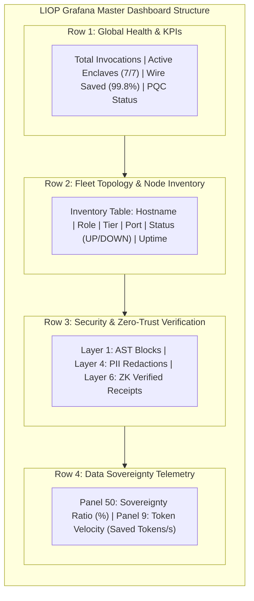

Operating a distributed Logic-Injection-on-Origin mesh requires multi-dimensional observability. Because compute executes in-situ within remote enclaves, SRE teams must track both network transport health and enclave-side security boundaries (PII rejections, AST traps, and post-quantum cryptographic handshakes).

The LIOP observability architecture operates across two tiers:
- **Tier A (In-Situ Native Telemetry)**: The SDK tracks CPU fuel, token consumption (`TokenTelemetryEngine`), and wire bytes eliminated with zero external dependencies.
- **Tier B (Production Fleet Monitoring)**: Prometheus scrapes native `/metrics` endpoints across all enclaves and visualizes fleet state through a 26-panel Grafana master dashboard.

---

## 1. Prometheus Metrics Taxonomy

All metrics use the canonical `liop_` prefix:

### Computational & Protocol Metrics

| Metric Name | Type | Labels | Description & Formula |
|---|---|---|---|
| `liop_tool_calls_total` | Counter | `capability`, `status`, `role` | Total tool invocations. `role="executor"` for data enclaves; `role="proxy"` for BLG. |
| `liop_tool_execution_duration_seconds` | Histogram | `capability` | End-to-end execution latency including AST inspection and V8 sandboxing. |
| `liop_tokens_saved_total` | Counter | `capability` | Cumulative LLM context tokens eliminated (`originTokens - outputTokens`). |
| `liop_wire_egress_bytes_total` | Counter | `direction` | Network wire bytes transmitted versus baseline uncompressed context pull. |

### Security & Cryptographic Metrics

| Metric Name | Type | Labels | Description |
|---|---|---|---|
| `liop_pqc_handshakes_total` | Counter | `status`, `algorithm` | Count of post-quantum ML-KEM-768 key exchanges negotiated. |
| `liop_pqc_handshake_duration_ms` | Histogram | `algorithm` | Key encapsulation and decapsulation latency (target: < 2ms). |
| `liop_zk_receipts_verified_total` | Counter | `status` | Mathematical HMAC-SHA256 computational receipts verified. |
| `liop_egress_pii_violations_total` | Counter | `rule_id`, `enclave` | Attempts by injected logic to leak forbidden keys, PANs, or SSNs. |
| `liop_ast_rejections_total` | Counter | `violation_type` | Payloads blocked by Guardian AST for attempting unauthorized imports. |

### Infrastructure & Circuit Breaker Metrics

| Metric Name | Type | Labels | Description |
|---|---|---|---|
| `liop_mesh_peers_connected` | Gauge | `node_id`, `tier` | Realtime count of active libp2p peers connected via Kademlia DHT. |
| `liop_circuit_breaker_tripped_total` | Counter | `target_endpoint` | Number of times a route tripped after 5 consecutive failures. |
| `liop_worker_pool_active_threads` | Gauge | `enclave` | Number of Piscina threads currently executing crypto or AST tasks. |

---

## 2. Critical Alert Catalog & Remediation Procedures

Below are production alerting rules defined in `examples/observability/alerting_rules.yml`:

### Alert 1: `LiopRepeatedEnclaveEgressRejection`

```yaml
- alert: LiopRepeatedEnclaveEgressRejection
  expr: rate(liop_egress_pii_violations_total[2m]) > 0.1
  for: 1m
  labels:
    severity: critical
  annotations:
    summary: "Repeated PII Exfiltration Detected on Enclave {{ $labels.enclave }}"
    description: "Injected logic on {{ $labels.enclave }} triggered over 10 PII egress violations in the last 2 minutes."
```

#### Remediation Procedure
1. **Identify the Caller**: Check `AuditInterceptor` logs on the target enclave for `requesterPeerId` or OAuth `clientId`.
2. **Revoke Access**: Invalidate the client's token in Nexus OIDC:
   ```bash
   curl -X POST http://liop-nexus:15000/admin/clients/{clientId}/revoke
   ```
3. **Inspect Injected Code**: Retrieve the payload hash from the audit log and review the offending logic in the quarantine directory.

---

### Alert 2: `LiopCircuitBreakerTripped`

```yaml
- alert: LiopCircuitBreakerTripped
  expr: increase(liop_circuit_breaker_tripped_total[5m]) > 0
  for: 30s
  labels:
    severity: warning
  annotations:
    summary: "Circuit Breaker Tripped for Route {{ $labels.target_endpoint }}"
    description: "Endpoint {{ $labels.target_endpoint }} failed 5 consecutive health checks and has been quarantined."
```

#### Remediation Procedure
1. **Verify Target Host**: Check if the container or process is responsive:
   ```bash
   docker ps --filter "name={{ $labels.target_endpoint }}"
   ```
2. **Check gRPC Port Health**: Send a synthetic probe from the BLG perimeter:
   ```bash
   grpc_health_probe -addr={{ $labels.target_endpoint }}
   ```
3. **Inspect Worker Pool Logs**: If the host is up, check if the Piscina worker pool crashed due to heap exhaustion (`maxHeapMb`). Restart the service if threads wedged.

---

### Alert 3: `LiopHighExecutionLatency`

```yaml
- alert: LiopHighExecutionLatency
  expr: histogram_quantile(0.99, sum(rate(liop_tool_execution_duration_seconds_bucket[5m])) by (le, capability)) > 5.0
  for: 2m
  labels:
    severity: warning
  annotations:
    summary: "p99 Execution Latency Exceeds 5s on {{ $labels.capability }}"
```

#### Remediation Procedure
1. **Analyze AST Fuel**: Verify if injected payloads contain complex unbounded nested loops.
2. **Scale Piscina Worker Threads**: In high-throughput clusters, increase `workerPool.maxThreads` or raise CPU limits in the container deployment manifest.

---

## 3. Grafana Master Dashboard Architecture

The LIOP Master Dashboard (`examples/observability/dashboards/master-dashboard.json`) organizes operational health into structured sections:



### Canonical PromQL Invariant

In all Prometheus PromQL expressions, set operators like `or` operate strictly between instant vectors. Always write:

```promql
# Correct: Vector fallback
(sum(rate(liop_tokens_saved_total[5m])) or vector(0))

# Prohibited: Scalar fallback causes syntax error
(sum(rate(liop_tokens_saved_total[5m])) or 0)
```
