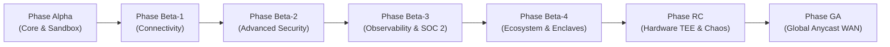

The Logic-Injection-on-Origin Protocol (LIOP) roadmap establishes the architectural transition from a local sovereign Docker testnet into an autonomous, globally distributed zero-trust mesh. The protocol operates across enterprise firewalls, sovereign enclaves, and heterogeneous cloud environments.

---

## Strategic Evolution Timeline

| Phase | Timeline | Focus Area | Verification Standard |
|---|---|---|---|
| **Phase Alpha** | Q3 2025 - Q3 2026 | Core V8 Sandbox & Post-Quantum Wire | Complete (64/64 test suites green) |
| **Phase Beta-1** | Q3 2026 | NAT Traversal, Relay v2, Keepalive & DoS | Complete (Live Docker multi-node mesh) |
| **Phase Beta-2** | Q3 2026 | ML-DSA-65 Signatures, mTLS & gRPC-Web | Complete (100% Biome and test parity) |
| **Phase Beta-3** | Q3 2026 - Q4 2026 | OpenTelemetry, Prometheus & SOC 2 Trail | Complete (Sub-second scrape latency) |
| **Phase Beta-4** | Q4 2026 | Tri-tier Sovereign Mesh & Studio Console | Complete (64/64 audit tests pass) |
| **Phase RC** | Q4 2026 - Q1 2027 | Hardware TEE Attestation & Chaos Testing | In Progress (AWS Nitro & AMD SEV-SNP) |
| **Phase GA** | Q2 2027 - Q3 2027 | Anycast Supernodes, Native QUIC & Gossipsub | Planned (Global multi-region rollout) |

---

## 1. Production-Certified Milestones

### Phase Alpha: Core Architecture and Zero-Trust Sandbox
- **V8 Isolate Sandboxing**: Enforces 27 poisoned global identifiers, 11 deeply frozen core prototypes, and a 32 KB AST Taint Analyzer (Information Flow Control) to block PII derivation and memory side channels.
- **Post-Quantum Cryptography**: Implements ML-KEM-768 (`mlkem`, NIST FIPS 203) for quantum-resistant intent handshakes, symmetric AES-256-GCM encryption, and HMAC-SHA256 computational receipts anchored to dataset hashes.
- **Differential Privacy**: Incorporates Laplace noise generation with CSPRNG and a three-tier analytical budget (`FORBIDDEN`, `SENSITIVE`, `PUBLIC`) aligned with NIST SP 800-226.
- **Dual-Era MCP Bridge**: Protocol transcoding engine supporting modern MCP v2 (2026-07-28) and legacy MCP v1 (2025-11-25) clients.

### Phase Beta-1: Global Network Connectivity and Firewall Resilience
- **P2P NAT Traversal Stack**: Integrates `@libp2p/autonat`, `@libp2p/circuit-relay-v2`, `@libp2p/dcutr`, and `@libp2p/mdns` for decentralized hole punching through stateful NATs.
- **Symmetric gRPC Keepalive**: Standardized channel options (`keepalive_time_ms: 30000`, `keepalive_timeout_ms: 10000`, `permit_without_calls: 1`) that prevent silent enterprise firewall teardowns.
- **Rate Limiting and DoS Defense**: Integrated token bucket rate limiter protecting `POST /mcp` with HTTP 429 and `Retry-After` headers conforming to OWASP API4:2023.
- **Fail-Closed TLS Hardening**: Strict certificate enforcement under production environments, preventing accidental unencrypted fallbacks.

### Phase Beta-2: Advanced Security, Post-Quantum Signatures and Firewalls
- **Post-Quantum Digital Signatures**: Implemented ML-DSA-65 (NIST FIPS 204) via `@noble/post-quantum` for canonical manifest sealing and node identity verification.
- **Strict Session Key Lifetime**: Hard 1-hour TTL (3,600 seconds) ceiling on all ML-KEM-768 session keys, rejecting expired credentials per NIST SP 800-53 controls.
- **Bidirectional mTLS with Hot-Reloading**: Created `CertManager` with filesystem watchers for live X.509 certificate rotations without service interruption.
- **gRPC-Web HTTP/1.1 Framing**: Implemented RFC-compliant 5-byte framing in `LiopHybridGateway`, allowing browsers and corporate HTTP/1.1 proxies to invoke LIOP nodes directly.

### Phase Beta-3: Enterprise Observability and Regulatory Compliance
- **Kubernetes Probes and Graceful Drain**: Operational `/healthz` and `/readyz` probes with DHT status checks and connection-draining timeouts.
- **Prometheus Native Telemetry**: Synchronous metric scrapers exposing `liop_mesh_peers_connected`, `liop_manifest_cache_size`, and execution gauges.
- **OpenTelemetry Semantic Convention**: Unified traces capturing `gen_ai.client.token.usage` and runtime durations across distributed calls.
- **Immutable Audit Trail**: Append-only cryptographic hash chain maintaining non-repudiation records for SOC 2 Type II and HIPAA evaluations.
- **Deterministic AST-Based Fuel Metering**: 100-bucket instruction quantization that eliminates timing side-channels per NIST SP 800-53.

### Phase Beta-4: Developer Ecosystem and Sovereign Enclaves
- **Interactive Web Playground**: Local web console streaming real-time execution phases, telemetry charts, and cryptographic proofs over Server-Sent Events.
- **Multi-Tier Sovereign Enclaves**: Physical network segmentation using 256-bit swarm keys (`pnet`), routing sensitive Tier 1 transactions through the Border LIO Gateway.
- **Automated Production Audit Suite**: Comprehensive 12-suite audit runner testing container network conditions under simulated jitter, delay, and packet loss.

---

## 2. Upcoming Architectural Milestones

### Phase RC: Production Resilience, Hardware TEE and Rust Core Parity
- **Target Window**: Q4 2026 to Q1 2027.
- **Rust Core Parity (`servers/liop-node`)**:
  - Implement native `libp2p-pnet` swarm key isolation in Rust.
  - Implement full dual-era MCP transcoding directly inside the Rust gateway.
  - Maintain symmetric Tonic gRPC keepalive channel options across all enclaves.
- **Hardware TEE Remote Attestation**:
  - Integrate hardware attestation verification for AMD SEV-SNP (`snp_report_t`) and AWS Nitro Enclaves (`COSE_Sign1`), replacing simulation stubs with direct cryptographic measurements.
- **Automated Chaos Engineering**:
  - Execute automated test scenarios simulating multi-region network partitions, 300 ms transoceanic latency spikes, and sudden bootstrap node evictions.
- **Geo-Proximity Dynamic Routing**:
  - Route execution payloads to geographically proximate nodes using round-trip latency measurements and circuit breakers.

### Phase GA: Global Network Availability and High-Performance WAN
- **Target Window**: Q2 2027 to Q3 2027.
- **Dedicated Global Bootstrap Clusters**:
  - Deploy geo-distributed Anycast bootstrap clusters in US-East, EU-West, and AP-Southeast, removing reliance on public bootstrap networks.
- **Native QUIC Transport**:
  - Integrate `@libp2p/quic` to enable 0-RTT handshakes and high-throughput execution across transcontinental links.
- **Browser-Native WebTransport**:
  - Adopt WebTransport to allow web-based clients and browser isolates to connect directly to the mesh without intermediate gateways.
- **PubSub Gossipsub Topology Sync**:
  - Propagate node discovery, capability announcements, and key revocations in real time using libp2p Gossipsub.

---

## 3. Dependency Matrix by Phase

| Phase | Package Installation Command | Architectural Purpose |
|---|---|---|
| **Beta-1** *(Complete)* | `pnpm add @libp2p/autonat @libp2p/circuit-relay-v2 @libp2p/dcutr @libp2p/mdns` | NAT Traversal, Circuit Relay, Hole Punching, LAN Discovery |
| **Beta-2** *(Complete)* | `pnpm add @noble/post-quantum @grpc/grpc-js-web` | Dilithium ML-DSA signatures and gRPC-Web fallback |
| **Beta-3** *(Complete)* | `pnpm add @opentelemetry/sdk-node @opentelemetry/exporter-otlp-http prom-client` | OpenTelemetry OTLP tracing, Prometheus exporter and metrics |
| **RC** *(Active)* | `pnpm add @aws-sdk/client-nitro-enclaves-attestation` | AWS Nitro Enclaves hardware attestation verification |
| **GA** *(Planned)* | `pnpm add @libp2p/quic @libp2p/webtransport @chainsafe/libp2p-gossipsub` | 0-RTT QUIC, browser WebTransport, Gossipsub push network |
