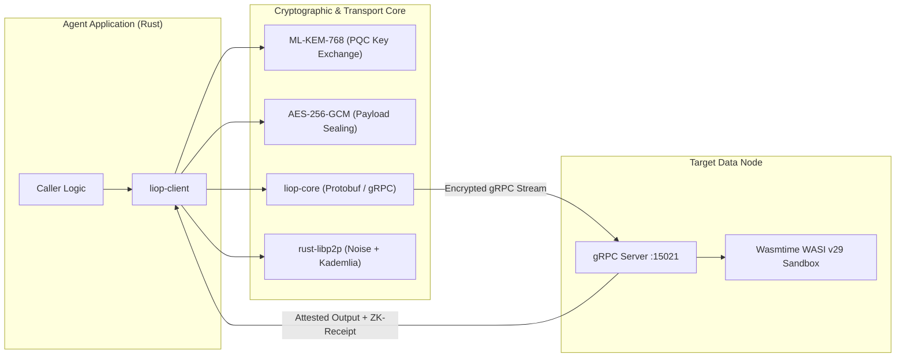

The Logic-Injection-on-Origin Protocol (LIOP) provides high-performance native Rust crates engineered for low-latency agent runtimes, systems software, and embedded enclaves. 

<Warning>
  The Rust SDK is currently in **Alpha (v0.1.0)** under active development. Interfaces and function signatures may evolve prior to formal publication on [crates.io](https://crates.io). For immediate production deployments requiring multi-tier gateway routing, automated OAuth 2.1 tokens, and battle-tested L7 interceptors, refer to the [TypeScript SDK](/typescript-sdk/overview).
</Warning>

---

## Architecture of the Crates

The Rust implementation is partitioned into two specialized crates within the repository workspace:

<CardGroup cols={2}>
  <Card title="liop-core" icon="cube">
    **Binary Protocol & Stubs**: Protocol Buffer definitions (`liop_core.proto`) compiled through `tonic` and `prost`. Exports typed gRPC service traits, client stubs, and network message types without pulling heavy runtime dependencies.
  </Card>
  <Card title="liop-client" icon="network-wired">
    **Agent Execution Engine**: High-level client runtime encapsulating Zero-Trust intent negotiation, post-quantum key encapsulation (ML-KEM-768), symmetric payload sealing (AES-256-GCM), and cryptographic ZK-Receipt validation.
  </Card>
</CardGroup>



---

## Cargo Dependency Configuration

Until official publication on `crates.io`, consume the crates directly from the GitHub repository or as a path dependency in a monorepo workspace.

### Consuming from Git Repository

Add the following to your `Cargo.toml`:

```toml Cargo.toml
[dependencies]
liop-core = { git = "https://github.com/Nekzus/LIOP", branch = "main" }
liop-client = { git = "https://github.com/Nekzus/LIOP", branch = "main" }

# Tokio asynchronous runtime
tokio = { version = "1.37", features = ["rt-multi-thread", "macros"] }
```

### Consuming via Local Workspace Path

If developing within a local clone of the LIOP repository:

```toml Cargo.toml
[dependencies]
liop-core = { path = "sdks/rust/crates/core" }
liop-client = { path = "sdks/rust/crates/client" }
tokio = { version = "1.37", features = ["rt-multi-thread", "macros"] }
```

---

## In-Situ WASI Logic Injection Example

The `liop-client` crate exposes the `inject_logic` function, automating the full five-stage cryptographic lifecycle:

1. **Zero-Trust Intent Negotiation**: Establishes session parameters with the destination node.
2. **Post-Quantum Key Exchange**: Generates an ephemeral ML-KEM-768 keypair and encapsulates a 256-bit shared secret.
3. **Payload Sealing**: Encrypts the compiled guest WASM binary (`wasm32-wasip1`) using AES-256-GCM.
4. **Asynchronous Stream Dispatch**: Dispatches the encrypted module over Tonic gRPC to the host sandbox.
5. **ZK-Receipt Verification**: Verifies the host's HMAC-SHA256 computational proof against the session secret and payload digest.

```rust src/main.rs
use liop_client::injector::inject_logic;
use std::error::Error;

#[tokio::main]
async fn main() -> Result<(), Box<dyn Error>> {
    // Address of the sovereign target node (e.g., Vault Enclave or Edge Node)
    let endpoint = "http://127.0.0.1:15021";
    let wasm_path = "./target/wasm32-wasip1/release/order_filter.wasm";

    println!("[Agent] Injecting compiled analytical logic into {}", endpoint);

    // Automated execution of intent, key encapsulation, transport, and verification
    let response = inject_logic(endpoint, wasm_path).await?;

    println!("[Agent] Response status: {}", response.status);
    println!("[Agent] Aggregated result: {}", response.data);
    println!("[Agent] Verified ZK-Receipt: {}", response.zk_receipt);

    Ok(())
}
```

---

## Technical Specifications & Dependencies

The crates maintain minimal dependency graphs to ensure deterministic compilation and zero memory leaks:

| Component | Technology | Version | Architectural Responsibility |
|---|---|---|---|
| **gRPC Transport** | `tonic` | 0.12 | Asynchronous HTTP/2 framing, backpressure, and bidirectional streaming |
| **Serialization** | `prost` | 0.13 | Efficient binary Protocol Buffer encoding and decoding |
| **Post-Quantum Cryptography** | `pqcrypto-kyber` | 0.8 | ML-KEM-768 key encapsulation mechanism resistant to Shor's algorithm |
| **Symmetric Encryption** | `aes-gcm` | 0.10 | Authenticated encryption with associated data (AEAD) for WASM modules |
| **P2P Networking** | `rust-libp2p` | 0.54 | Decentralized peer discovery via Kademlia DHT and Noise protocol security |
| **Async Runtime** | `tokio` | 1.37 | Multi-threaded non-blocking runtime engine |

---

## Roadmap to `crates.io` Publication

The development path for the Rust SDK encompasses three primary milestones:

1. **WASI Preview 2 (Component Model) Support**: Migrating from `wasm32-wasip1` to WASI Preview 2 WIT interfaces for rich, strongly-typed object exchange across the guest-host boundary.
2. **Ergonomic Server Traits**: Exposing a high-level `LiopServer` trait matching the TypeScript ergonomics, enabling developers to author native Rust data enclaves with minimal boilerplate.
3. **Crates.io Automated CI/CD Pipeline**: Establishing automated cargo-release workflows with OIDC provenance verification.
