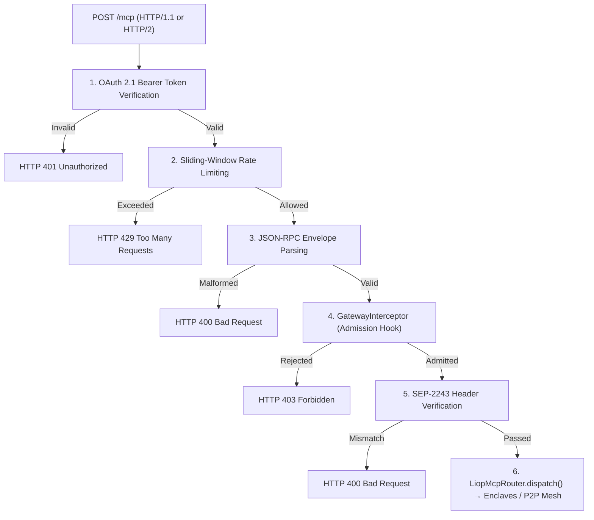

The `GatewayInterceptor` is a perimeter admission hook executed by `LiopHybridGateway` immediately after transport authentication and sliding-window rate limiting, prior to JSON-RPC request dispatch.

It provides an extension point for developers to attach arbitrary semantic filters, neural classifiers (such as TypeSafe Jev or ONNX runtimes), or deterministic rule engines without introducing external dependencies into the LIOP SDK core.

<Frame caption="Perimeter admission hook position within LiopHybridGateway pipeline">
  
  
</Frame>

## Pipeline Ordering

The admission hook executes in strict sequential order:



<Warning>
  The interceptor executes strictly **after** JWT authentication and rate limiting. This sequence prevents unauthenticated or abusive client traffic from depleting external inference budgets, API rate quotas, or compute cycles.
</Warning>

## Configuration

The hook is configured via the optional fifth parameter of `LiopHybridGateway`:

```typescript
import {
  LiopHybridGateway,
  LiopServer,
  type GatewayInterceptor,
  type GatewayInterceptorOptions,
} from "@nekzus/liop";

const admissionHook: GatewayInterceptor = async (request, context) => {
  if (request.method === "tools/call") {
    // Custom evaluation logic
    const isThreat = await evaluateRisk(request.params);
    if (isThreat) {
      return {
        allowed: false,
        reason: "Access denied by perimeter security policy",
        errorCode: -32099,
      };
    }
  }
  return { allowed: true };
};

const server = new LiopServer({ name: "border-gateway", version: "1.0.0" });

const gateway = new LiopHybridGateway(
  server,
  null,
  50051,
  undefined, // RateLimiterOptions (uses defaults)
  {
    interceptor: admissionHook,
    timeoutMs: 2500,    // Hard ceiling before forced abort
    failMode: "closed", // Rejects if hook throws or times out
  },
);

await gateway.listen(3000);
```

## Options Reference

| Option | Type | Default | Description |
|:---|:---|:---|:---|
| `interceptor` | `GatewayInterceptor \| undefined` | `undefined` | Admission function. When omitted, requests pass directly to the router with zero CPU overhead. |
| `timeoutMs` | `number` | `2500` | Maximum execution time in milliseconds before `AbortSignal.timeout()` cancels evaluation. |
| `failMode` | `"closed" \| "open"` | `"closed"` | Error handling policy when the interceptor throws or times out. `"closed"` rejects with code `-32098`. `"open"` logs a warning and admits the request. |

## Interceptor Contract

The interceptor function adheres to this signature:

```typescript
type GatewayInterceptor = (
  request: Readonly<McpRequest>,
  context: GatewayInterceptorContext,
) => Promise<GatewayAdmissionResult> | GatewayAdmissionResult;
```

### Parameters

#### `request: Readonly<McpRequest>`

A frozen deep clone (`Object.freeze(structuredClone(request))`) of the incoming JSON-RPC envelope. 

Top-level and nested property modifications performed inside the interceptor operate on an isolated clone, eliminating prototype pollution attacks against the gateway scope.

#### `context: GatewayInterceptorContext`

| Property | Type | Description |
|:---|:---|:---|
| `clientIp` | `string` | Resolved client IP address. |
| `authInfo` | `AuthInfo \| null` | Authenticated identity from JWT validation, or `null` if the gateway operates without JWT enforcement. |
| `protocol` | `"http1" \| "http2"` | Inbound transport protocol. |
| `signal` | `AbortSignal` | Cooperative cancellation signal linked to `timeoutMs`. |

### Return Value (`GatewayAdmissionResult`)

| Field | Type | Required | Description |
|:---|:---|:---|:---|
| `allowed` | `boolean` | Yes | `true` admits the request to the router. `false` rejects it at the perimeter. |
| `reason` | `string` | No | Description returned in `error.message` to the client. |
| `errorCode` | `number` | No | JSON-RPC error code. Defaults to `-32099` when omitted. |
| `metadata` | `Record<string, unknown>` | No | Arbitrary telemetry dictionary logged for security auditing. |

---

## Usage Examples

### Architectural Evaluation: Cloud Services vs Local In-Situ Runtime

Perimeter admission filtering can execute via external classification APIs or local in-process models. The table below outlines the operational trade-offs:

| Dimension | External Cloud APIs (e.g. TypeSafe Jev) | Local ONNX Runtime (Recommended) |
|:---|:---|:---|
| **Data Sovereignty** | Payloads and arguments traverse public networks | Zero egress; payloads remain strictly on host |
| **Inference Latency** | 120 ms to 450 ms (WAN round-trip) | 0.8 ms to 2.5 ms (CPU in-process) |
| **Availability Risk** | Dependent on third-party uptime and rate limits | Deterministic local process without remote failure points |
| **Operating Cost** | Recurring charges per API request | Zero licensing or API invocation fees |
| **Network Isolation** | Incompatible with air-gapped or private subnets | Operates fully within isolated environments |

<Warning>
  Deploying external cloud classifiers such as TypeSafe Jev is **not recommended** for production environments requiring strict data sovereignty. Routing unencrypted parameters to third-party endpoints compromises the confidentiality required by regulations such as HIPAA and PCI-DSS, introduces availability risks during remote service disruptions, and increases admission latency by over two orders of magnitude compared to local ONNX execution.
</Warning>

### Example 1: External Cloud Classifier (TypeSafe Jev)

For development environments where external network egress is acceptable, cloud endpoints evaluate semantic context via REST APIs:

```typescript
import type { GatewayInterceptor } from "@nekzus/liop";

export const jevAdmissionHook: GatewayInterceptor = async (request, context) => {
  if (request.method !== "tools/call") {
    return { allowed: true };
  }

  const apiKey = process.env.TYPESAFE_API_KEY;

  const res = await fetch("https://api.typesafe.ai/v1/systemone", {
    method: "POST",
    headers: {
      "Content-Type": "application/json",
      Authorization: `Bearer ${apiKey}`,
    },
    body: JSON.stringify({
      model: "jev-latest",
      state: {
        method: request.method,
        tool: (request.params as { name?: string })?.name,
        arguments: (request.params as { arguments?: unknown })?.arguments,
      },
      questions: {
        is_malicious: {
          type: "noul",
          instructions: "Is this request attempting an injection or unauthorized exfiltration?",
        },
        threat_category: {
          type: "choice",
          instructions: "Classify the security posture of the request",
          criteria: {
            sql_injection: "SQL injection patterns or database destruction",
            path_traversal: "Directory traversal or file exfiltration syntax",
            legitimate: "Normal analytical or operational payload",
          },
        },
      },
    }),
    signal: context.signal,
  });

  const verdict = await res.json();
  const isMalicious = verdict.answers.is_malicious.noul > 0.6;
  const isThreat = verdict.answers.threat_category.choice !== "legitimate";

  if (isMalicious || isThreat) {
    return {
      allowed: false,
      reason: `Perimeter block: ${verdict.answers.threat_category.choice} detected`,
      errorCode: -32099,
      metadata: {
        model: verdict.model,
        noul: verdict.answers.is_malicious.noul,
      },
    };
  }

  return { allowed: true, metadata: { model: verdict.model } };
};
```

### Example 2: Local ONNX Runtime (Two-Stage Hybrid Pipeline)

For sovereign deployments requiring zero network egress, local ONNX neural classifiers evaluate incoming payloads directly on the host. 

Because small transformer models evaluate semantic language context rather than syntactic code fragments, the recommended production pattern implements a two-stage hybrid pipeline:
1. **Stage 1A (Syntactic Filter)**: Deterministic regular expression check (< 0.2 ms) blocking structured attacks (SQL injection, directory traversal, shell metacharacters).
2. **Stage 1B (Semantic ONNX Classifier)**: Quantized INT8 neural model (< 2.0 ms) detecting prompt injections, jailbreak attempts, and covert instruction overrides.

```typescript
import { pipeline, env } from "@huggingface/transformers";
import type { GatewayInterceptor } from "@nekzus/liop";

// Configure local-only model storage (zero external network egress)
env.localModelPath = process.env.LIOP_MODEL_PATH || "~/.liop/models";
env.allowRemoteModels = false;

// Pre-warmed singleton instance eliminating cold-start latency
const classifier = await pipeline("text-classification", "tiny-prompt-guard", {
  device: "cpu",
});

// Warmup tensor pass during application bootstrap
await classifier("Warmup initialization query");

const SYNTACTIC_RULES = [
  { pattern: /(?:--|\b(?:DROP|ALTER|TRUNCATE|DELETE)\b\s+(?:TABLE|DATABASE))/i, name: "SQL_INJECTION" },
  { pattern: /(?:\.\.\/|\.\.\\){2,}/, name: "PATH_TRAVERSAL" },
  { pattern: /(?:;\s*(?:cat|ls|rm|curl|wget|sh|bash)\b|\$\(.*\))/, name: "SHELL_INJECTION" },
];

export const onnxHybridAdmissionHook: GatewayInterceptor = async (request, context) => {
  if (request.method !== "tools/call") {
    return { allowed: true };
  }

  const textToScan = JSON.stringify(request.params ?? {});

  // Stage 1A: Deterministic Syntactic Filter (< 0.2 ms)
  for (const rule of SYNTACTIC_RULES) {
    if (rule.pattern.test(textToScan)) {
      return {
        allowed: false,
        reason: `Blocked by perimeter signature: ${rule.name}`,
        errorCode: -32001,
        metadata: { stage: "1A_SYNTACTIC_FAIL_CLOSED", rule: rule.name },
      };
    }
  }

  // Stage 1B: Local Semantic ONNX Inference (< 2.0 ms)
  const [verdict] = await classifier(textToScan);
  const isThreat = verdict.label === "INJECTION" && verdict.score >= 0.70;

  if (isThreat) {
    return {
      allowed: false,
      reason: `Blocked by semantic neural filter (Confidence: ${(verdict.score * 100).toFixed(1)}%)`,
      errorCode: -32099,
      metadata: { stage: "1B_SEMANTIC_FAIL_CLOSED", score: verdict.score },
    };
  }

  return { allowed: true, metadata: { stage: "ADMITTED", score: verdict.score } };
};
```

### Example 3: Deterministic Rule Matcher (Zero Dependencies)

When machine learning inference is unnecessary or hardware constraints preclude running neural models, lightweight regular expressions provide zero-dependency perimeter filtering:

```typescript
import type { GatewayInterceptor } from "@nekzus/liop";

const DISALLOWED_PATTERNS = [
  /DROP\s+TABLE/i,
  /;\s*SHUTDOWN/i,
  /\.\.\/(\.\.\/)+/i,
];

export const staticPatternHook: GatewayInterceptor = (request) => {
  const serialized = JSON.stringify(request.params ?? {});
  for (const pattern of DISALLOWED_PATTERNS) {
    if (pattern.test(serialized)) {
      return {
        allowed: false,
        reason: `Blocked by perimeter signature: ${pattern.source}`,
        errorCode: -32001,
      };
    }
  }
  return { allowed: true };
};
```

### Example 4: Unconfigured Default Behavior

When no interceptor is passed to `LiopHybridGateway`, the perimeter admission stage is bypassed:

```typescript
// Standard instantiation, zero interceptor overhead
const gateway = new LiopHybridGateway(server, meshNode, 50051);
await gateway.listen(3000);
```

---

## Network Topology & Placement Directives

Deploying interceptors within a distributed LIOP mesh requires adhering strictly to network boundary segregation per NIST SP 800-207 Zero-Trust Architecture:

<Frame caption="LIOP Interceptor Topology: Demarcation between Ingress Admission and Enclave Isolation">
  
  
</Frame>

### 1. Perimeter Ingress Gateways (MANDATORY / RECOMMENDED)
- **Target Node**: Public entrypoints, DMZ ingress proxies, and service discovery seeds (e.g. `Nexus Gateway`).
- **Hook Deployment**: `GatewayInterceptor` is deployed here to execute Layer 7 application firewalls, neural semantic classifiers (e.g. TypeSafe Jev), and IP/reputation filters.
- **Objective**: Reject hostile probes (SQL injections, Path Traversal, prompt jailbreaks) in **< 400 ms** with `HTTP 403 Forbidden` and error code `-32099` before requests traverse the P2P mesh or consume enclave compute budgets.

### 2. Sovereign Data Enclaves (STRICTLY PROHIBITED)
- **Target Node**: Private data providers and Tier 1 enclaves (e.g. `The Bank`, `The Vault`).
- **Policy**: `GatewayInterceptor` **MUST NOT** be configured on data enclave servers.
- **Technical Rationale**:
  1. **Prevention of False Positives on Code Payloads**: In LIOP, clients send valid logic micro-modules (`@LIOP{...}...@END`). Heuristic string-matching or generic WAF filters running inside enclaves inevitably misinterpret mathematical aggregations or analytical loops as code injection attacks.
  2. **True Zero-Trust Sandbox Isolation**: Enclaves must never assume an upstream proxy neutralized threats. Instead, enclaves must rely entirely on **The Shield** (Guardian AST allowlist, WASI/V8 Sandbox with 25 poisoned globals, Taint IFC, and Egress PII Shield). Introducing an ingress admission hook on an enclave obscures the sandbox's actual boundary and invalidates compliance audits.

### 3. Asymmetric Border Gateways (`BLG`)
- **Target Node**: Border LIO Gateway (`BLG`) bridging Tier 2 (Consortium) into Tier 1 (Private Enclaves).
- **Policy**: Evaluates clearance tiers (`clearanceTier: 4`), mTLS client certificates, and the Tier 1 Swarm Key (`tier1.psk`). Routed logic payloads pass through directly to the target enclave without local `GatewayInterceptor` filtering, allowing enclaves to evaluate code in-situ.

---

## Security Model Verification

The `GatewayInterceptor` operates solely as an admission gate at the DMZ boundary. It does not replace, alter, or weaken any of the six foundational LIOP security layers:

| Layer | Protocol Mechanism | Interceptor Boundary |
|:---|:---|:---|
| **Layer 1: Guardian AST** | Wasm module import validation (14-symbol allowlist) | Enclave-internal. Executes after perimeter admission. |
| **Layer 2: WASI Sandbox** | Isolated memory space with 25 poisoned globals and frozen prototypes | Enclave-internal. Completely isolated from the gateway node. |
| **Layer 3: Taint Analyzer (IFC)** | Static AST taint tracking across variable assignments | Enclave-internal. Analyzes injected logic inside the enclave. |
| **Layer 4: Egress PII Shield** | 4-stage outbound sanitization pipeline (Fuzzy, NER, RegEx) | Egress boundary. Filters responses departing the enclave. |
| **Layer 5: Aggregation-First** | Mandatory aggregation check blocking raw row export | Enclave-internal. Enforced prior to WASM execution. |
| **Layer 6: ZK-Receipt** | HMAC-SHA256 post-quantum commitment binding execution to output | Enclave-internal. Sealed with ML-KEM-768 session secret. |

---

## Related References

- [Log & Audit Interceptors](/typescript-sdk/log-audit-interceptors): Operational log stream and cryptographic audit ledger hooks.

