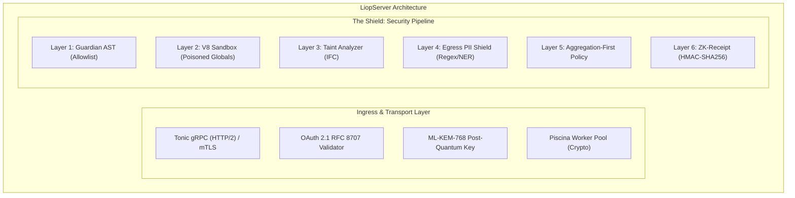

The `LiopServer` class represents the host-side infrastructure of the Logic-Injection-on-Origin Protocol. It hosts sensitive datasets, enforces cryptographic boundaries, validates incoming WebAssembly or JavaScript logic modules via Guardian AST, and executes them inside isolated V8 sandboxes under strict CPU fuel and memory constraints.

Rather than exposing high-risk REST or SQL query endpoints to remote AI agents, a `LiopServer` exposes typed **Capabilities** (Tools). Agents submit compiled computation payloads to execute in-situ, ensuring raw rows never traverse the network.



---

## Server Instantiation & Configuration

Initialize a Data Node by defining its identity and node characteristics:

```typescript
import { LiopServer, PII_PRESETS } from "@nekzus/liop";

const server = new LiopServer(
  {
    name: "ConfidentialBankEnclave",
    version: "2.4.0",
  },
  {
    tokenSlug: "BANK",
    port: 15021,
    workerPool: {
      enabled: true,
      maxThreads: 8,
      maxHeapMb: 128,
      idleTimeout: 30_000,
    },
    security: {
      forbiddenKeys: ["password", "secret", "privateKey", "cvv", "raw_balance"],
      piiPatterns: [
        ...PII_PRESETS.US_COMPLIANT,
        /[A-Z]{2}\d{6}[A-Z]/, // Internal clearance badge pattern
      ],
      enableNerScanning: true,
      rateLimit: {
        maxPerWindow: 60,
        windowMs: 60_000,
      },
    },
    taxonomy: {
      domain: "financial-ledger",
      clearanceTier: 4,
      executionTypes: ["aggregation", "statistical-audit"],
    },
  },
);
```

### Server Configuration Options

<ParamField path="serverInfo" type="object" required>
  Canonical identity announced during protocol handshakes.
  
  <Expandable title="serverInfo Properties">
    <ResponseField name="name" type="string" required>
      Identifier of the data node (e.g. `"EnterpriseVault"`).
    </ResponseField>
    <ResponseField name="version" type="string" required>
      SemVer version string of the host deployment.
    </ResponseField>
  </Expandable>
</ParamField>

<ParamField path="options" type="ServerOptions" optional>
  Comprehensive security, thread scheduling, and taxonomy configurations.

  <Expandable title="ServerOptions Properties">
    <ResponseField name="port" type="number" optional>
      TCP port on which the gRPC transport binds (default: `50051`).
    </ResponseField>
    <ResponseField name="tokenSlug" type="string" optional>
      Canonical uppercase identifier (e.g. `"BANK"`) used by clients to resolve authentication credentials dynamically (`LIOP_TOKEN_<tokenSlug>`). Must match `/^[A-Z][A-Z0-9_]*$/`.
    </ResponseField>
    <ResponseField name="workerPool.enabled" type="boolean" optional>
      When `true`, offloads cryptographic handshakes (ML-KEM-768) and AST parsing to a background `Piscina` worker pool (default: `true`).
    </ResponseField>
    <ResponseField name="workerPool.maxThreads" type="number" optional>
      Maximum number of background worker threads spawned (default: available CPU cores).
    </ResponseField>
    <ResponseField name="workerPool.maxHeapMb" type="number" optional>
      Hard heap limit per worker in megabytes to prevent memory exhaustion attacks (default: `64`). Configurable via `LIOP_WORKER_MAX_HEAP_MB`.
    </ResponseField>
    <ResponseField name="security.forbiddenKeys" type="string[]" optional>
      JSON keys stripped or rejected if detected anywhere within the output object graph (default: `["password", "token", "secret", "privateKey"]`).
    </ResponseField>
    <ResponseField name="security.piiPatterns" type="PiiRule[]" optional>
      Array of regex patterns or presets (`GLOBAL_STRICT`, `EU_GDPR`, `US_COMPLIANT`) scanned across all outgoing strings.
    </ResponseField>
    <ResponseField name="security.enableNerScanning" type="boolean" optional>
      Enables Named Entity Recognition scanning on egress text using natural language processing to identify names, locations, and organizations (default: `false`).
    </ResponseField>
    <ResponseField name="security.rateLimit" type="object" optional>
      Sliding window rate limiter per client peer (`maxPerWindow`, `windowMs`).
    </ResponseField>
    <ResponseField name="taxonomy.domain" type="string" optional>
      Operational domain (e.g. `"healthcare"`, `"financial"`). Announced on the DHT for automatic routing.
    </ResponseField>
    <ResponseField name="taxonomy.clearanceTier" type="number" optional>
      Required caller security clearance tier (`1` to `5`). Requests with insufficient clearance are rejected with HTTP 403.
    </ResponseField>
    <ResponseField name="taxonomy.executionTypes" type="string[]" optional>
      Allowed compute types (`"aggregation"`, `"differential-privacy"`, `"analytics"`).
    </ResponseField>
  </Expandable>
</ParamField>

---

## Defining Capabilities (`tool`)

Capabilities represent executable analytical tools exposed to the mesh. Define them with typed schemas using [Zod](https://zod.dev):

```typescript
import { z } from "zod";

server.tool(
  "Analyze_Account_Risk",
  "Computes statistical risk metrics for bank accounts without exporting raw ledger rows.",
  {
    accountId: z.string().regex(/^ACC-\d{5}$/, "Invalid account identifier"),
    timeframe: z.enum(["7d", "30d", "90d"]),
    thresholdAmount: z.number().positive(),
  },
  async ({ accountId, timeframe, thresholdAmount }) => {
    // 1. Fetch internal ledger from database
    const transactions = await db.fetchLedger(accountId, timeframe);

    // 2. Perform analytical calculation at the origin
    const highValueTxCount = transactions.filter(tx => tx.amount >= thresholdAmount).length;
    const avgVelocity = transactions.reduce((sum, tx) => sum + tx.amount, 0) / transactions.length;

    // 3. Return strictly aggregated results
    return {
      content: [
        {
          type: "text",
          text: JSON.stringify({
            accountId,
            highValueAlerts: highValueTxCount,
            meanTransactionVelocity: avgVelocity,
            riskScore: highValueTxCount > 5 ? "ELEVATED" : "NORMAL",
          }),
        },
      ],
    };
  },
);
```

### In-Situ Logic Execution Pipeline

When an agent passes dynamic logic bytecode (`.wasm` or JavaScript envelopes), the execution lifecycle enforces six distinct layers of defense:

1. **Layer 1 (Guardian AST)**: Parses and inspects the abstract syntax tree before execution. Only 14 standard functions from `wasi_snapshot_preview1` are permitted. Any attempt to reference unauthorized host symbols aborts immediately.
2. **Layer 2 (V8 Sandbox Isolation)**: Executes code inside an isolated V8 context where 25 potentially unsafe globals (`process`, `require`, `eval`, `Function`, `setTimeout`, `fetch`, `WebSocket`) are replaced with poisoned proxies that immediately trigger memory traps upon access. Eleven native prototypes (`Object`, `Array`, `Promise`, etc.) are frozen using `Object.freeze` to satisfy PCI-DSS limits.
3. **Layer 3 (Taint Analyzer)**: Acorn-based information flow control tracks variable assignments to prevent side-channel derivation of confidential inputs via boolean inference or character-code indexing.
4. **Layer 4 (Egress PII Shield)**: Scans outbound data against fuzzy matches, credit card patterns, IBAN formulas, and NER entity detection.
5. **Layer 5 (Aggregation-First Policy)**: Enforces that query outputs return summary statistics. Returning raw entity arrays triggers automatic policy rejection.
6. **Layer 6 (ZK-Receipt Generation)**: Computes an HMAC-SHA256 digest binding the returned output to the exact SHA-256 hash of the injected logic module, sealed using the ephemeral post-quantum session key.

---

## Exposing Data Resources & Prompts

In addition to executable capabilities, `LiopServer` exposes schemas, static references, and templated guidance to instruct AI agents.

### Publishing Resources

```typescript
server.resource(
  "Ledger Table Schema",
  "liop://schemas/financial/ledger.v1",
  "JSON schema describing fields and types in the internal ledger table.",
  "application/json",
  JSON.stringify({
    type: "object",
    properties: {
      tx_id: { type: "string" },
      timestamp: { type: "string", format: "date-time" },
      amount: { type: "number" },
      currency: { type: "string" },
    },
  }),
);
```

### Registering Prompts

```typescript
server.prompt(
  "audit_ledger_risk",
  "Instructs the agent on structuring in-situ WASM modules for ledger audits.",
  [
    { name: "accountId", description: "Target account identifier", required: true },
    { name: "strictness", description: "Audit tolerance level", required: false },
  ],
  (request) => ({
    description: "Ledger Risk Audit Template",
    messages: [
      {
        role: "user",
        content: {
          type: "text",
          text: `Evaluate account ${request.arguments?.accountId} with strictness ${request.arguments?.strictness ?? "standard"}. Output only aggregated statistics.`,
        },
      },
    ],
  }),
);
```

### Autonomous Prompt Injection (`enableZeroShotAutonomy`)

Activating autonomous mode injects the `liop_blind_analyst` system prompt and binds the host Data Dictionary dynamically:

```typescript
server.enableZeroShotAutonomy();
```

---

## Server Lifecycle & Network Binding

```typescript
// Start server on default or configured gRPC port
await server.connect();
console.log(`LiopServer listening on port ${server.getBoundPort()}`);

// Start server with explicit P2P Kademlia mesh bootstrap
await server.connectToMesh({
  port: 15021,
  meshConfig: {
    bootstrapNodes: ["/ip4/198.51.100.10/tcp/15001/p2p/12D3KooW..."],
    listenAddresses: ["/ip4/0.0.0.0/tcp/15002"],
    identityPath: "/etc/liop/enclave-identity.json",
  },
});

// Invalidate in-memory AST cache when policies change
server.clearAstCache();

// Graceful termination
await server.close();
```

---

## Public Methods Reference

| Method | Parameters | Return Type | Description |
|---|---|---|---|
| `connect(port?)` | `port?: number` | `Promise<void>` | Binds gRPC server to port and begins accepting incoming intent handshakes. |
| `connectToMesh(options)` | `options: MeshConnectOptions` | `Promise<void>` | Boots both local gRPC service and full P2P `libp2p` DHT participant. |
| `tool(name, desc, schema, handler)` | `string, string, ZodRawShape, Handler` | `this` | Registers a typed capability with automatic input validation. |
| `resource(name, uri, desc, mime, content)` | `string, string, string, string, string` | `this` | Publishes a discoverable schema or static reference artifact. |
| `prompt(name, desc, args, handler)` | `string, string, PromptArg[], Handler` | `this` | Registers a structured prompt template for agent orchestration. |
| `enableZeroShotAutonomy()` | None | `this` | Injects the Blind Analyst prompt and internal data dictionary into the mesh. |
| `clearAstCache()` | None | `void` | Flushes parsed Guardian AST evaluation results from memory. |
| `getServerInfo()` | None | `{ name: string; version: string }` | Returns registered host identity metadata. |
| `getMeshNode()` | None | `MeshNode \| null` | Returns the active `libp2p` node instance when mesh mode is enabled. |
| `getBoundPort()` | None | `number` | Returns the assigned local TCP port of the running gRPC server. |
| `close()` | None | `Promise<void>` | Shuts down gRPC server, drains Piscina worker pool, and closes DHT sockets. |
